# Basic Go 1 - Package in Go

Đầu tiên chúng ta sẽ lướt nhanh qua những thứ cơ bản trước.

Bắt đầu bằng tìm hiểu Package trong Go
**Package**

- Package clause :

  - Mỗi file Go **phải bắt đầu bằng một package clause**, điều này giúp Go xác định file đó thuộc về package nào.

  - Package clause rất quan trọng vì nó xác định vị trí của file trong hệ thống package của Go.

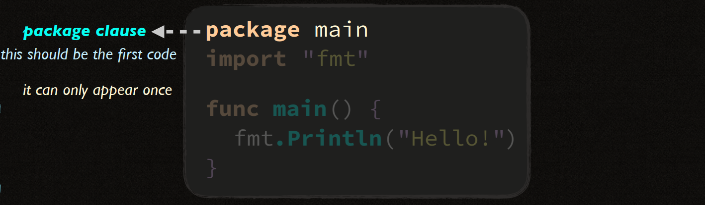

- **Package Scope** : Trong Go, khi bạn khai báo bất kỳ phần tử nào như **variables**, **constants**, hoặc **types** bên ngoài **function**, thì những khai báo đó **có phạm vi trên toàn bộ package**. Điều này nghĩa là các file khác trong cùng một package có thể truy cập và sử dụng các khai báo đó mà **không cần định nghĩa lại**.

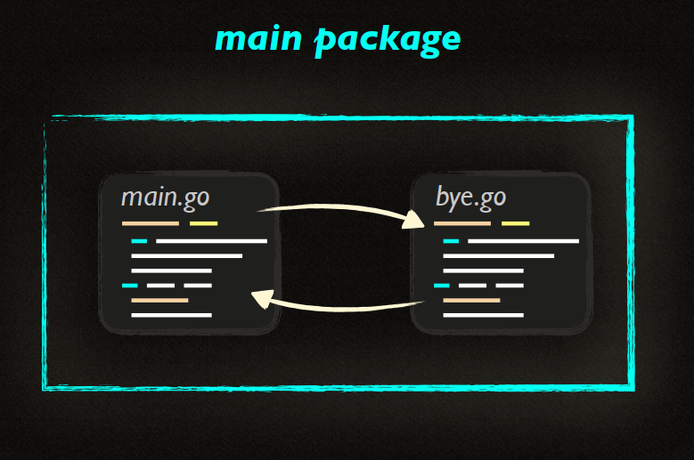

- Importing : Khi bạn import một package, tất cả các khai báo (declared elements) trong package đó sẽ trở nên khả dụng trong file hiện tại mà không cần phải khai báo lại. Điều này cho phép bạn sử dụng các hàm và kiểu dữ liệu từ các thư viện chuẩn hoặc các package bên thứ ba một cách dễ dàng.

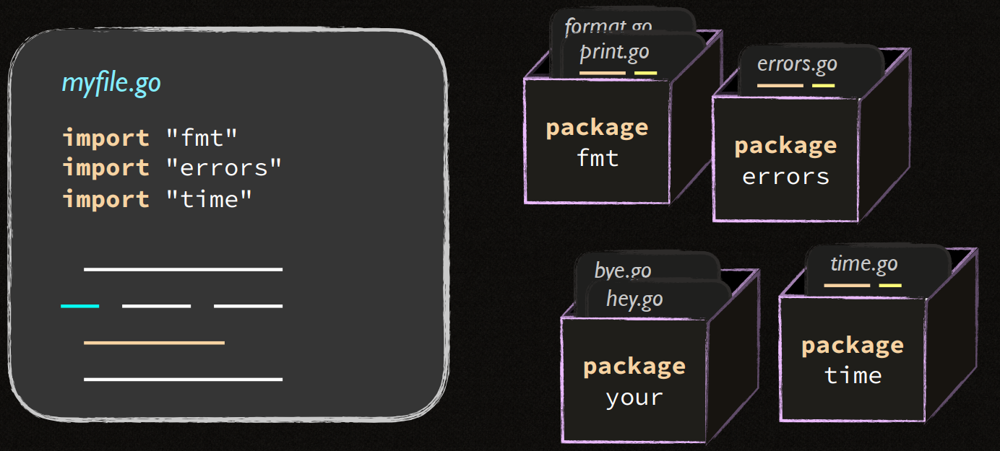

- **Package Scope cho Functions** : Tương tự như các **variables** và **constants**, các hàm được khai báo **bên ngoài block** cũng có **phạm vi trên toàn package**. Điều này có nghĩa là bất kỳ file nào trong cùng một package đều có thể gọi các hàm này.

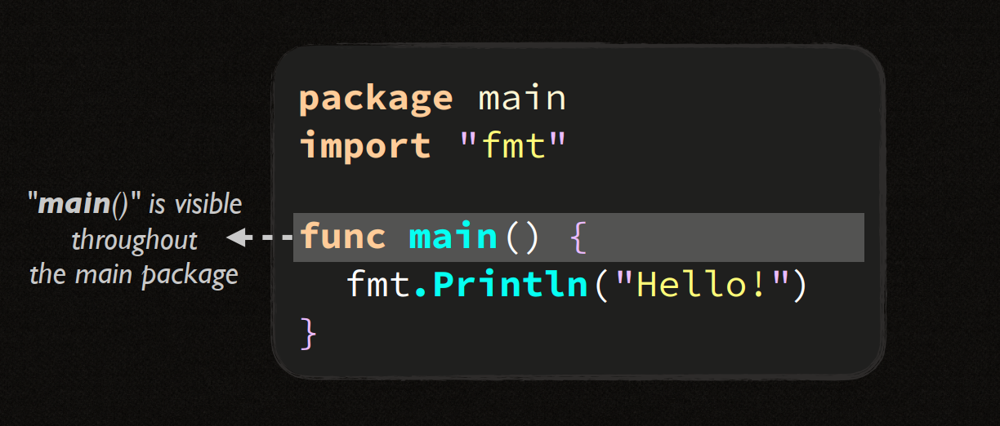.

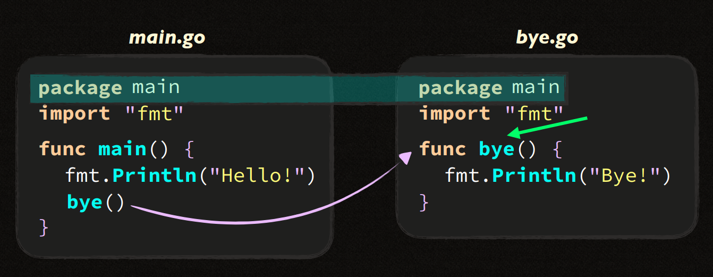

- **Scope trong GO** :
  Trong Go, mỗi dòng code có thể thuộc về một phạm vi (scope) khác nhau, tùy thuộc vào vị trí của nó trong file. Điều này ảnh hưởng đến nơi mà biến hoặc hàm có thể được truy cập và sử dụng.

      - **File Scope**: Các phần tử được khai báo ở mức file **(ngoài các block) chỉ có thể được truy cập từ bất kỳ đâu trong file đó**. Chúng không thể được sử dụng từ các file khác, ngay cả khi chúng nằm trong cùng một package.

      - **Package Scope** : Các phần tử như **package main** hoặc các **câu lệnh import có package scope**, **nghĩa là chúng có thể được sử dụng bởi bất kỳ file nào thuộc cùng một package**.

      - Block Scope : Các phần tử được khai báo bên trong một block (ví dụ như bên trong hàm hoặc vòng lặp) có block scope, **chỉ có thể truy cập từ bên trong block và không thể được sử dụng bên ngoài**.

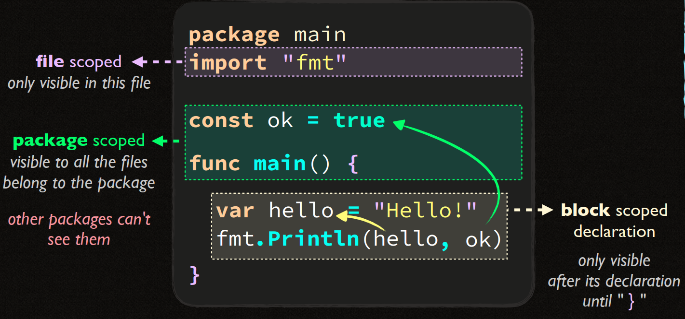
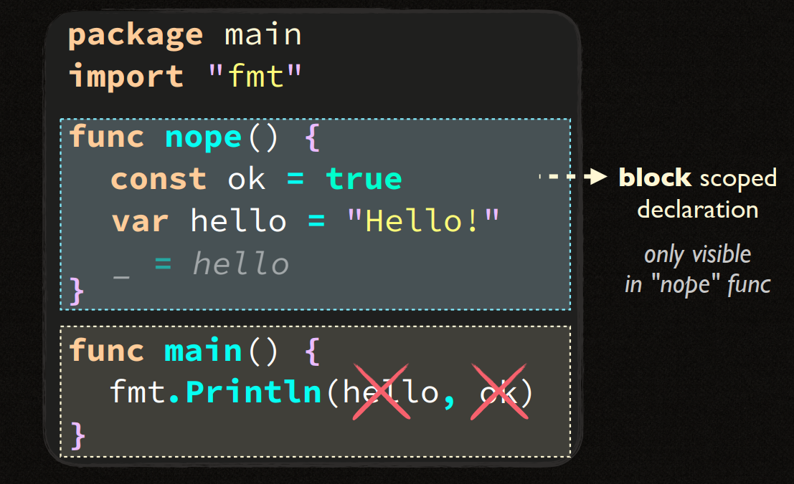

- File Scope :

  - Mỗi file Go có **scope** riêng, nghĩa là các phần tử như **variables**, **constants**, **types**, và **functions** được khai báo trong một file chỉ có thể được truy cập trong phạm vi của chính file đó, trừ khi chúng được khai báo ở mức **package scope**.
  - Các package được **import** chỉ có thể được sử dụng trong file đã thực hiện import. Điều này có nghĩa là nếu bạn muốn sử dụng một package trong nhiều file khác nhau, bạn cần phải import package đó riêng biệt trong từng file.

  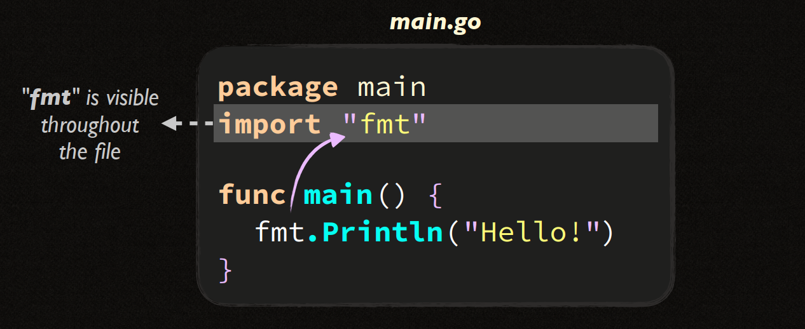
  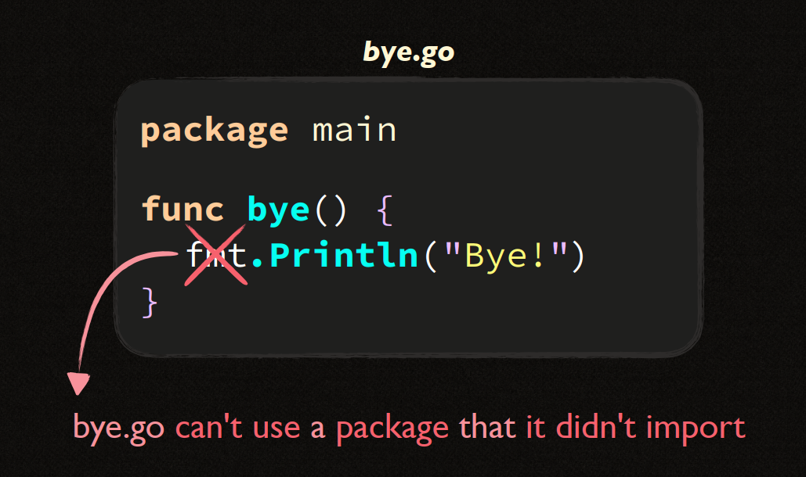
  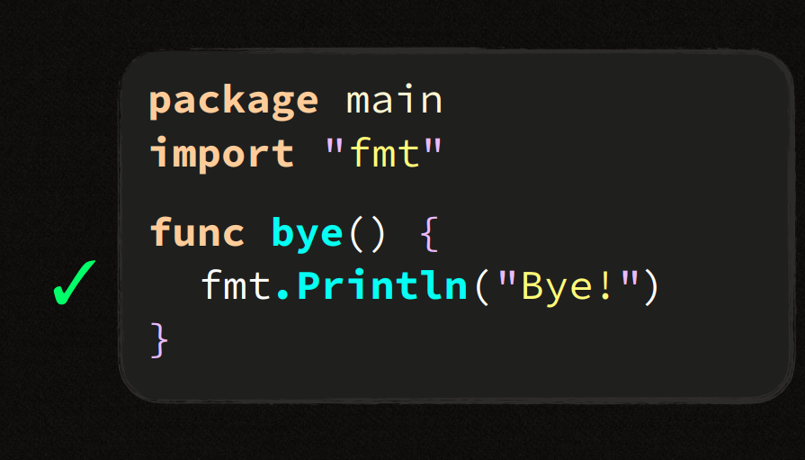

- **Package Kinds** : Trong Go có 2 loại Package đó là **Executable Package** và **Libary Package**.
  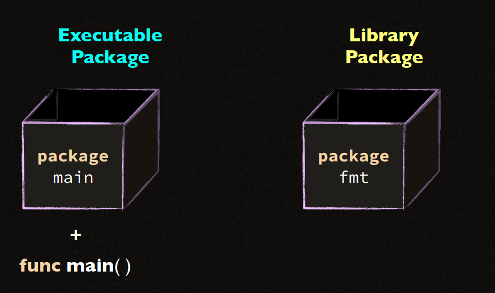
  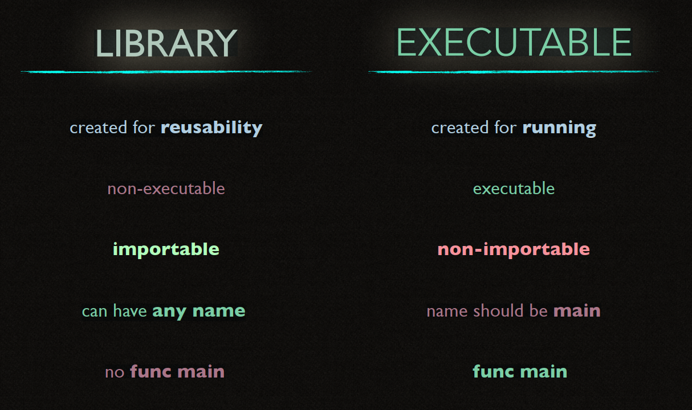
