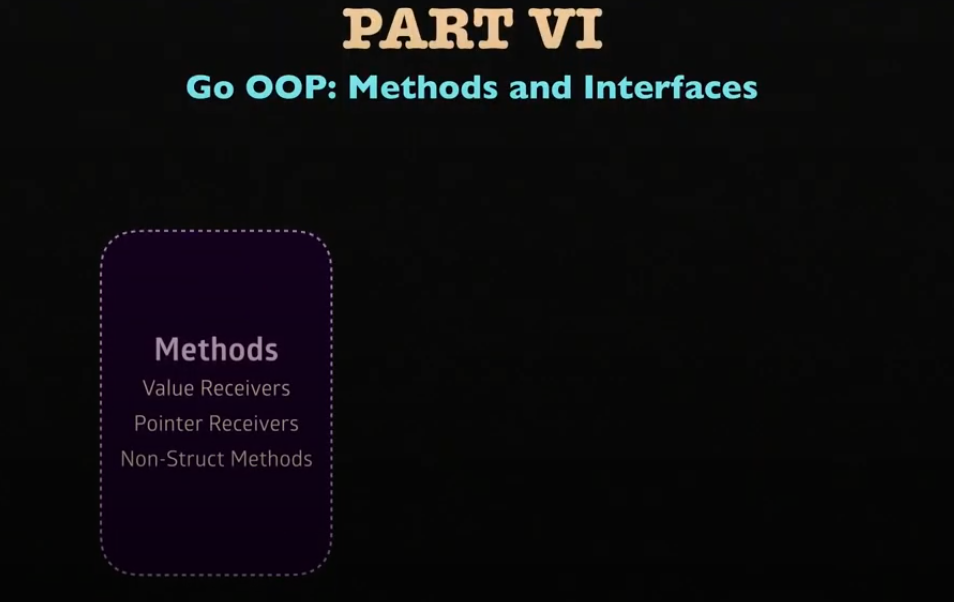

Series số 10 này sẽ tìm hiểu về ```Methods and Interface - Methods```.
.
# Basic Go 10 - Methods and Interface - Methods



- Đầu tiên ta sẽ có các file sau.

```go
    // book.go
    package main

    import "fmt"

    type book struct {
        title string
        price float64
    }

    func (b book) print() {
        // b is a copy of the original `book` value here.
        fmt.Printf("%-15s: $%.2f\n", b.title, b.price)
    }

    // ----------------------------------------------------------------------------
    // + you can use the same method names among different types.
    // + you don't need to type `printGame`, it's just: `print`.
    //
    // func (b book) printBook() {
    // 	// b is a copy of the original `book` value here.
    // 	fmt.Printf("%-15s: $%.2f\n", b.title, b.price)
    // }

    // ----------------------------------------------------------------------------
    // b is a copy of the original `book` value here.
    //
    // func printBook(b book) {
    // 	fmt.Printf("%-15s: $%.2f\n", b.title, b.price)
    // }
```

```go
    // game.go
    package main

    import "fmt"

    type game struct {
        title string
        price float64
    }

    func (g game) print() {
        fmt.Printf("%-15s: $%.2f\n", g.title, g.price)
    }

    // PREVIOUS CODE:

    // ----------------------------------------------------------------------------
    // you can use same method name among different types.
    // you don't need to type `printGame`, it's just: `print`.
    //
    // func (g game) printGame() {
    // 	fmt.Printf("%-15s: $%.2f\n", g.title, g.price)
    // }

    // ----------------------------------------------------------------------------
    // you cannot use the same function name within the same package.
    //
    // func printGame(g game) {
    // 	fmt.Printf("%-15s: $%.2f\n", g.title, g.price)
    // }

```

```go
    package main

    func main() {
        mobydick := book{
            title: "moby dick",
            price: 10,
        }

        minecraft := game{
            title: "minecraft",
            price: 20,
        }

        tetris := game{
            title: "tetris",
            price: 5,
        }

        // #3
        mobydick.print()  // sends `mobydick` value to `book.print`
        minecraft.print() // sends `minecraft` value to `game.print`
        tetris.print()    // sends `tetris` value to `game.print`

        // #2
        // mobydick.printBook()
        // minecraft.printGame()

        // #1
        // printBook(mobydick)
        // printGame(minecraft)
    }
```

- Dựa trên 3 file ```book.go```,```game.go```, và ```main.go```, chúng ta sẽ phân tích về **Scope**, **Data** , **behavior**, methods.

1. **Data and Behavior**

- **Only data** : 

    - Khi bạn chỉ khai báo dữ liệu, không có bất kỳ hành vi nào được liên kết với dữ liệu đó.

    - Các kiểu dữ liệu như ```struct``` trong Go chỉ lưu dữ liệu mà không có bất kì logic hoạt động nào trên chúng.

    ```go
        type book struct {
            title string
            price float64
        }
    ```

    - Ở đây, ```book``` chỉ đơn giản là một **container** chứa thông tin về ```title``` và ```price```. Không có hành vi gì được định nghĩa cho type ```book```.

- **Data and Behavior** (Method gắn với dữ liệu):

    - Khi bạn thêm một method vào một data type, điều này cho phép data type đó có thêm behavior (hành vi)

    - Method là một hàm được gắn với **receiver** - đó có thể là **value** hoặc **pointer**.

    ```go
        func (b book) printBook() {
            fmt.Printf("%-15s: $%.2f\n", b.title, b.price)
        }
    ```

    - Ở đây, method ```print()``` được gắn với type ```book```.

    - Điều này có nghĩa là đối tượng ```book``` không chỉ chứa data (```title```,```price```) mà còn có khả năng tự in ra nội dung của nó.

-  **Value Receiver**:

    - Method có thể nhận data bằng cách nhận một **instance** của đối tượng.

    - Điều này gọi là **value receiver**.

    - Method sẽ ghi nhận một **instance** của giá trị , có nghĩa là mọi thay đổi trong Method **Không ảnh hưởng** đến giá trị ban đầu.

    ```go
        func (b book) print() {
            // `b` là một **instance** của đối tượng `book`
            fmt.Printf("%-15s: $%.2f\n", b.title, b.price)
        }
    ```

    - Trong Method trên, ```b``` là một **instance** của đối tượng ```book``` khi gọi ```mobydick.print()```. Nếu bạn thay đổi giá trị của b trong Method, giá trị gốc của ```mobydick``` sẽ không bị thay đổi.

- **Vấn đề trùng lặp tên Method**

    - Ví dụ ta tạo 2 method ```print``` cho instance ```b``` và ```g``` của book và game

    ```go
        func (b book) print() {
            fmt.Printf("%-15s: $%.2f\n", b.title, b.price)
        }

        func (g game) print() {
            fmt.Printf("%-15s: $%.2f\n", g.title, g.price)
        }
    ```

    - Một điểm mạnh của Go là bạn có thể sử dụng **Cùng một tên Methods** cho các Data type khác nhau trong cùng một package.

    - Điều này được gọi là **Method overloading per type**

2. Lưu ý đặc biệt trong Method : **Pointer Receiver Change the Value**

- Trên ví dụ trên thì chúng ta đã tìm hiểu qua **Value receiver**, Còn bây giờ thì sẽ tìm hiểu về **Pointer Receiver**.

- Trong Go, khi một **method** sử dụng **Pointer receiver** thay vì **Value receiver**, bạn có thể **thay đổi trực tiếp** giá trị của đối tượng ban đầu.

- Điều này cực kỳ hữu ích khi bạn muốn thay các thay đổi của một **Method** được phản ánh bên ngoài , thay vì chỉ thay đổi cục bộ (local).

    **So sánh nhanh :**

    - Value receiver : Method này nhận một **instance** của đối tượng. Các thay đổi bên trong sẽ **không ảnh hưởng** đến đối tượng gốc.

    - Pointer receiver : Method này nhận một **Pointer** trỏ tới đối tượng gốc. Các thay đổi bên trong sẽ **thay đổi trực tiếp** đối tượng gốc.

    ```go
        func (b *book) discount(discountRate float64){
            b.price = b.price * (1-discountRate)
        }
    ```

    - lúc này ở file main gọi lại discount thì sẽ như này

    ```go
        func main {
            mobydick := book {
                title:"Moby Dick",
                price :100
            }

            fmt.Println("Giá gốc:", mobydick.price) // Giá ban đầu: 100

            // Gọi method discount với Pointer Receiver
            mobydick.discount(0.1) // Giảm 10%

            fmt.Println("Giá sau khi giảm:", mobydick.price) // Giá sau khi giảm: 90
        }
    ```

     Tại sao sử dụng **Pointer receiver** ?

    - Khi bạn muốn **thay đổi giá trị** của đối tượng trong một **Method** và muốn các thay đổi đó phản ánh bên ngoài **Method**, sử dụng **pointer receiver** là bắt buộc.

    - Sử dụng **pointer receiver** còn giúp tránh việc **sao chép** đối tượng lớn, dẫn đến hiệu suất tốt hơn khi làm việc với dữ liệu lớn hoặc cấu trúc phức tạp. 

    Một số lưu ý:

    - **Struct nhỏ** (có ít trường hoặc đơn giản) có thể sử dụng **value receiver** nếu bạn không cần thay đổi giá trị của đối tượng.

    - **Struct lớn** hoặc khi bạn muốn thay đổi giá trị của đối tượng thì nên sử dụng **pointer receiver**.

3. Lưu ý đặc biệt : **Non-Struct attach methods to almost any type**

    Trong Go, ngoài việc gắn **Method** cho **struct** ra thì nó còn hỗ trợ cho **hầu hết các kiểu dữ liệu** (gần như là tất cả, trừ 1 số trường hợp đặc biệt).

    Điều này cho phép bạn mở rộng hành vi của các kiểu dữ liệu cơ bản (ví dụ : int , float, string) hoặc các kiểu **Type alias**.

    Miễn là kiểu đó không phải **Pointer**, **interface**, hoặc **kiểu có thể bị trưu tượng hoá** thì vẫn có thể gắn **Method**.


    ```go
        package main

        import "fmt"

        // Định nghĩa alias cho kiểu `int`
        type myInt int

        // Gắn method `double` cho kiểu `myInt`
        func (m myInt) double() myInt {
            return m * 2
        }

        func main() {
            var num myInt = 10

            // Gọi method `double`
            fmt.Println("Giá trị gấp đôi của", num, "là", num.double()) // Output: Giá trị gấp đôi của 10 là 20
        }
    ```

    ```go
        package main

        import "fmt"

        // Định nghĩa alias cho kiểu `string`
        type myString string

        // Gắn methods `sayHello` cho kiểu `myString`
        func (s myString) sayHello() {
            fmt.Println("Xin chào,", s)
        }


        func main() {
            var greet myString = "Go Developer"

            // Gọi methods `sayHello`
            greet.sayHello() // Output: Xin chào, Go Developer
        }

    ```

    Miễn không phải type data = pointer thì Non-struct vẫn dùng được **Pointer receiver**

    ```go

        package main

        import "fmt"

        // Định nghĩa alias cho kiểu `int`
        type myInt int

        // Gắn method tăng giá trị với pointer receiver
        func (m *myInt) increment() {
            *m = *m + 1
        }

        func main() {
            var num myInt = 10

            // Gọi method `increment` để thay đổi giá trị của `num`
            num.increment()
            fmt.Println("Giá trị sau khi tăng:", num) // Output: Giá trị sau khi tăng: 11
        }

    ```

    Tóm lại **Non-struct types** trong go có vài giới hạn đó là :

    - Không thể gắn **Method** trực tiếp vào **data type** (```int```,```float64```) mà phải tạo một **Type alias**.
    ```go
        type myInt int
        type myFloat64 float64
    ```

    - **Method** không thể gắn trực tiếp lên **data type** = **pointer** , **map** , **slice** , **channel**. Nhưng có thể gắn **Method** vào alias của các data type này.