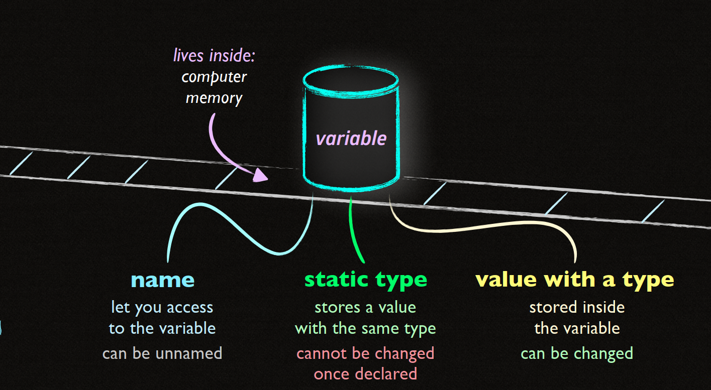
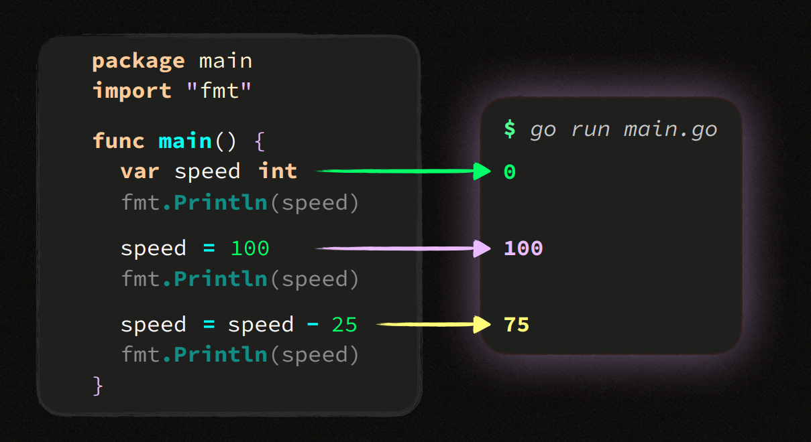

Trước đó chúng ta đã tìm hiểu về Package và cách tổ chức các Scope trong Go,Tiếp theo bài này chung ta sẽ tìm hiểu về Variable và Data-type.

# Basic Go 2 - Variable & Data type


Variable là các vùng nhớ chứa name, Được sử dụng để lưu trữ giá trị trong quá trình chương trình thực thi. Hiểu và sử dụng đúng cách giúp bạn viết code dễ dàng hơn, linh hoạt và dễ bảo trì.

**Declaration syntax**

```go
var speed int
```
Chúng ta có cấu trúc như sau :
``` go
name  static_type    value_with_a_type
                     0
var   speed          int 
```
**Quy tắc đặt tên**:

**name** sẽ được bắt đầu bằng chữ cái bất kỳ hoặc bắt đầu bằng dấu _. Chữ Unicode cũng được.

ví dụ :

```go
var speed int     // ✔️ Hợp lệ
var SpeeD int     // ✔️ Hợp lệ
var _speed int    // ✔️ Hợp lệ
var 速度 int      // ✔️ Hợp lệ (Go hỗ trợ Unicode trong tên biến)

var 3speed int    // ❌ Sai (Tên biến không được bắt đầu bằng chữ số)
var !speed int    // ❌ Sai (Tên biến không được chứa ký tự đặc biệt)
var spe!ed int    // ❌ Sai (Tên biến không được chứa ký tự đặc biệt)
var var int       // ❌ Sai (Không được sử dụng từ khóa dành riêng của Go làm tên biến)
```

Tiếp theo là Type.
Trong go các variable được thiết kế theo cơ chế Strongly-type, nghĩa là mỗi biến đều có 1 Type cụ thể ngay từ khi bắt đầu khai báo. Type này sẽ quyết định loại giá trị trả về là gì và không thể thay đổi trong suốt quá trình thực thi.
```go
                integer literals
    int     ->  -1  0   27

                float literals
    float64 -> -.5  0.  1. 
               -0.5 0.0 1.0

                pre-declared constants
    bool    ->  true false

                string literal
    string  ->  "hi there 速度"
                unicode (utf-8 1-4 bytes)

```

```go
var nFiles  int
var counter int
var cPU     int

var heat    float64
var ratio   float64
var degree  float64

var off     bool
var valid   bool
var closed  bool

var msg     string
var name    string
var txt     string

```
**Zero data**

1 loại data cần lưu ý trong Go.
```go
booleans -> false
numerics -> 0
string   -> ""
pointer  -> nil
```

*Ví dụ:*

```go
package main()
import "fmt"

func main() {
    
    var speed   int
    var heat    float64
    var off     bool
    var brand   string

    fmt.Println(speed)
    fmt.Println(heat)
    fmt.Println(off)
    fmt.Println("%q\n", brand)
}
```

kết quả trả về :
```bash
go run main.go
0
0
false
""
```
**Multiple Declarations**

Bạn có thể khai báo nhiều variable trong 1 câu duy lệnh

```go
// ví dụ ban đầu chúng ta có các khai báo như thế này
    package main

    func main() {

        var speed int
        var brand string
        var heat float64
        var off bool

        // ...
    }

// chúng ta có thể viết như sau

    package main

    func main() {
        var (
            speed   int
            heat    float64
            off     bool
            brand   string
        )
        // ...
    }

// Hoặc những cách sau

    package main
    import "fmt"
    func main() {
        var speed,velocity int
        fmt.Println(speed,velocity) 
        // nó sẽ tương đương với var speed int , var veloctiy int
        // ...
    }
```

**Short declaration**

Bạn không cần phải sử dụng **var** và **type** trước và sau **name**

```go
    package main

    function main (){
        safe := true
        fmt.Println(safe)
    }
    // Short decalaration statement
    // :=
    // Khai báo và gán giá trị cho 1 variable

```

Có 1 vài lưu ý khi dùng short decalaration đó là:

- Short decalaration không sử dụng được cho **Package scope**
- Muốn sử dụng được cho **Package scope** phải khai báo đầu đủ syntax nếu không sẽ báo lỗi 

```go
    package main

    safe := true //❌

    func main () {
        fmt.Println(safe)
    }
```
**kết quả sẽ ra như này**

```bash
$ go run main.go
SYNTAX ERROR: non-declaration statement outside function body
```
Vì vậy phải khai báo đầy đủ ```var safe = true ``` và như này thì sẽ sử dụng được Package scope variable.

Tóm lại
```go
    //Quy tắc khi sử dụng package scope chúng ta phải bắt đầu bằng 1 keyword
    package main
    var safe = true
    func main (){

    }
    // ta thấy rằng package, var ,func là 1 keyword 

    // còn với short decalration không có keyword bắt đầu
    // safe := true => cho nên không thể dùng package scope variable
```

**Multiple short decalaration**

Bạn cũng có thể khai báo và gán (decalaration and initialize) cho nhiều variable khi sử dụng short decalarion

```go
    package main

    func main () {
        safe, speed := true ,50

        fmt.Println(safe,speed)
    }
```
kết quả trả về sẽ là:

```bash
    $ go run main.go
    true 50
```


**Redecalarion**

Trong short decalaration chúng ta có thể gán (initialize) cho 1 new variable và gán cho 1 variabel đã tồn tại trước đó.

``` go
    package main

    func main () {
        var safe bool
        safe, speed := true , 50
        //
    }
```

Như ta thấy rằng variable ```speed``` được khai báo và gán giá trị sau 1 variable đã tồn tại ```safe``` bằng cách sử dụng **short decalaration**.
và có 1 rule đó là : **Phải luôn đảm bảo có ít nhất 1 new variable**

```go
package main

func main () {

    speed := 10 // speed là 1 biến mới 
    speed, maxSpedd := 10, 100 // maxSpedd là 1 biến mới
}
```

## Vậy khi nào thì sử dụng short còn khi nào thì sử dụng normal ?

**Đối với normal**

- Khi bạn không biết giá tri cần gán vào (Dont know the initialize value).
- Khi cần sử dụng Package scoped variable.
- Khi bạn muốn Group variable lại với nhau để có thể đọc dễ dàng hơn.

**Đối với short**
- Khi đã biết giá trị của variable.
- Cần giữ cho code ngắn gọn.
- Dùng để redecalaration

##
**Assignment**
Có thể thay đổi value bằng cách dùng toán tử ```+ - / *```


**Multiple assignments**

```go 
    package main

    import ("fmt","time")
    
    func main () {
        var (
            speed int
            now time.time
        )
        
        speed, now = 100,time.Now()
        // fmt
    }
```

**Swapping**
Bạn cũng có thể swap value của variable khi sử dụng multiple assignment

```go
    package main

    import "fmt"

    func main () {
        var(
            speed       = 100
            prevSpeed   = 50
        )

        speed, prevSpeed = prevSpeed, speed
        // fmt
    }
```

#
... Về các statement như ifelse for v.v thì các bạn tự tìm hiểu nha.

Phần sau sẽ là tìm hiểu về ```Composite types```.
Trong ```Composite types``` có :  
+ ```Array```.
+ ```Slices```.
+ ```String Internals```.
+ ```Maps```.
+ ```Structs```.
