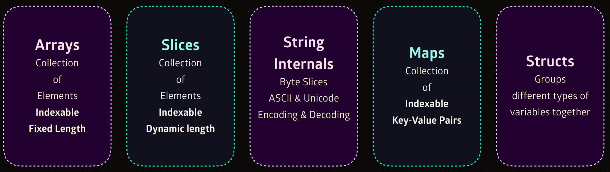

Trước đó chúng ta đã tìm hiểu về ```Variable và Data-type```. 
Series số 3 này sẽ tìm hiểu về ```Composite Types``` trong ```Composite Types``` sẽ có ```Arrays``` , Slices, ```String Internals```, ```Maps```, ```Structs``` Đặc biệt là ```Structs```.

# Basic Go 3 - Composite Types-Array


## Đầu tiên Hãy bắt đầu với Arrays.

Để bắt đầu thì chúng ta sẽ đi sâu hơn vào Arrays, một trong những cấu trúc dữ liệu cơ bản và quan trọng nhất trong Go. Array là một tập hợp các phần tử có cùng kiểu dữ liệu và được lưu trữ liên tiếp trong bộ nhớ. Điều này có nghĩa là các phần tử của array nằm cạnh nhau trong bộ nhớ , giúp tối ưu việc truy cập và thao tác với dữ liệu.

Đặc điểm chính của Arrays:

- ```Kích thước của array được cố định tại thời điểm khai báo``` và không thể thay đổi trong suốt quá trình runtime.
- Các phần tử của array có thể truy cập thông qua Index. Bắt đầu từ ```0```

```go
    var numbers [5]int // Mặc định kích thước là 5 và không thể thay đổi kích thước
    var numbers []int // Không mặc định kích thước và kích thước có thể thay đổi
```
    - Đối với ```[]int``` thực chất không phải là array mà là **slice** một kiểu dữ liệu động có thể thay đổi kích thước, nhưng cách hoạt động của nó lại dựa trên arrays....

- Getting and Setting Array Element.
Để setting và getting value cho 1 phần tử nào đó trong array thì luôn phải có **index** đi kèm.

```go
    var numbers []int
    numbers[0] = 10 //setting
    fmt.Println(numbers[0]) //getting
```

- Array literals.

Thay vì gán value từng giá trị riêng lẻ thì chúng ta có thể tạo bằng cách đưa 1 list các value trực tiếp .

- Array literals cũng là một dạng của composite literal

```go
    numbers := [5]int{1,2,3,4,5}
```

```go
    var books = [4]string{
        "kafka's revenge",
        "Sky golden",
        "Everythingship",
        "kafka's revenge 2nd editor"
    }
```
```go
    [4]string {
        "kafka's revenge",
        "Sky golden",
        "Everythingship",
        "kafka's revenge 2nd editor" 
    }
```
```go
    [4]string {
        "kafka's revenge",
        "Sky golden",
    }
    // => "kafka's revenge" "Sky golden" "" ""  
```
```go
    [4]string {
        "kafka's revenge",
        "Sky golden",
    }
    // => "kafka's revenge" "Sky golden" "" ""  
```

**Đặc biệt**

- **ELLIPSIS...**
- Bạn có thể sử dụng dấu ```ellipsis``` (...) khi khai báo array literal.
- Đối với Ellopsis này sẽ tự động tính toán số lượng phần tử mà bạn liệt kê trong array
```go
    [...]string{"Kafka", "Docker"} // 2 phần tử
```
- Composite Array.

Composite array cho phép lưu trữ các kiểu dữ liệu phức tạp, chẳng hạn như **struct** bên trong array. Điều này hữu ích khi muốn tổ chức data 1 cách có cấu trúc

```go
    type Person Struct {
        Name String
        Age int
    }

    people := [2]Person{
        {"A",30},
        {"B","25"}
    }
```


Ở đây, chúng ta đã tạo 1 array ```people``` chứa các đối tượng trong ```Person``` đó là ```Name```,```Age```

- Multi-Dimesional Array 

```go
    matrix := [2][3]int{
        {1,2,3},
        {4,5,6},
    }
```

```go
    matrix := [2][3]int{
        [3]in{1,2,3},
        [3]in{4,5,6},
    }
```

```go
    [2][3]int{
        [3]int{5, 6, 1}
        [3]int{9, 8, 4}
    }
```
- Named vs Unnamed Types

Trong Go, bạn có thể định nghĩa các kiểu array riêng bằng cách đặt tên cho chúng. Điều này giúp code dễ hiểu hơn và tái sử dụng hiệu quả hơn.

```go
    type Myarray [5]int
    var a MyArray
```

```go
    type bookcase [3int]

```
Ở đây, chúng ta đã tạo 1 kiểu Array có tên là ```Myarray```, và biến ```a``` có kiểu là ```MyArray```.

## Computer Memory và Memory Cells

Để hiểu sâu về cách mà array được lưu trữ và hoạt động, chúng ta cần tìm hiểu thêm về **Computer memory** và **Memory cells**

1. Computer Memory.
- Computer memory được chia thành nhiều ô nhớ nhỏ gọi là ```Memory cells```
- Mỗi ô nhớ (memory cell) có địa chỉ duy nhất và chiếm một kích thước cố định, thường sẽ là ```1 Byte```
- Dữ liệu được lưu trữ trong các ô nhớ liên tiếp này, giúp máy tính truy cập dữ liệu nhanh chong hơn.

2. Memory Cells.

- Khi bạn khai báo một array, một khối bộ nhớ liên tiếp được phân bổ cho nó.
- Mỗi phần tử array chiếm 1 số ô nhớ nhất định, tuỳ thuộc vào kiểu dữ liệu của phần tử đó.

Ví dụ : Một số nguyên (```int```) thường chiếm **4 Bytes** trong bộ nhớ.

Nếu bạn có một array gồm 5 số nguyên, thì tổng cộng array đó sẽ chiếm **20 Bytes**(5*4Bytes).

```go
    numbers := [5]int{10,20,30,40,50}
```

3. Allocation 
- **Memory allocation** là quá trình phân bổ bộ nhớ cho các biến và cấu trúc dữ liệu.
- Khi bạn tạo một array, bộ nhớ cho array được phân bổ liên tiếp, giúp tối ưu hoá việc truy cập dữ liệu.

```Đặc biệt```: 1 array trong Go lưu trữ các phần tử của nó trong **Contiguous memory cells**(ô nhớ liền kề). Điều này mang lại nhiều lợi ích về hiệu năng và khả năng truy cập nhanh chong.

- **CPU cache Lines**: Do các phần tử của array được lưu trư liên tiếp trong bộ nhớ, Chúng được tối ưu hoá cho CPU cache. Điều này có nghĩa là khi một phần tử được truy cập, các phần tử gần đó cũng được nạp vào cache, giúp cải thiện hiệu suất đáng kể.

- **Fast Access**: Truy cập các phần tử trong array có thời gian truy xuất là ***O(1)*** do các phần tử được lưu trữ trong bộ nhớ liền kề, cho phép bạn nhanh chóng tính toán vị trí của bất kỳ phần tử nào bằng cách sử dụng **index**

- **Direct Memory Mapping**: Array có sự ánh xạ trực tiếp tới cách lưu trữ trong bộ nhớ, giúp cho việc truy cập và thao tác dữ liệu nhanh chóng và hiệu quả hơn.

## Array size

Kích thước của một array được xác định dựa trên tổng kích thước của các kích thước mà nó chứa. Kích thước của array là một đặc tính cố định và không thể thay đổi.

- Total size calculation : Kích thước của array được tính bằng kích thước của một phần tử * số lương phần tử trong array.

```go
 var numbers [5]int
```
**=>** (int) chiếm 4 byte thì tổng sẽ là 20

## Array Length

Array length là số lượng phần tử mà array có thể lưu trữ và nó là một giá trị không thể thay đổi sau khi array được khai báo. 

- **Complie-Time Constant** : Độ dài của array phải được xác định tại thời điểm biên dịch(compile time) và không thể thay đổi trong quá trình runtime.
- **Maxium Capacity** : Độ dài của array xác định dung lượng tối đa mà nó có thể chứa. Nếu không đủ mà bạn muốn thêm thì phải khai báo 1 array mới

```go
var numbers [3]int
```
- Array trên chỉ có thể chứa tối đa 3 phần tử. Nếu cố vượt qua số lượng 3 này sẽ xảy ra lỗi tại thời điểm biên dịch.

``` Đặc biệt phải lưu ý ```

- **Non-Negative Length**: Độ dài không thể ```âm```
- **Fixed Capacity**: Nếu muốn cần lưu trữ nhiều hơn số lượng hiện tại, bạn phải tạo một array mới với dung lượng lớn hơn.

## Array's Elemnet Type 

Element Type của một array xác định loại giá trị mà nó có thể lưu trữ. Đây cũng là một phần rất quan trọng trong Go vì ngôn ngữ này có hệ thống kiểu dữ liệu rất chặt chẽ.

- **Homogeneous Element** : Tất cả các phần tử trong một array phải có cùng 1 kiểu dữ liệu. Điều này có nghĩa là bạn không thể trộn bất kì các loại giá trị nào khác nhau trong cùng một array.
- **Zero Value Initiallization**: Các phần tử của array chưa được khởi tạo sẽ tự động nhận giá trị mặc định (zero value) của kiểu dự liệu đó.

```go
    var numbers [5] int
    fmt.Println(numbers) // => [0 0 0 0 0] tất cả đều được khởi tạo với giá trị = 0
```

```Đặc biệt lưu ý```

- **Any valid Type**: Bạn có thể sử dụng bất kỳ dữ liệu nào như ```int```, ```float64```, ```string```, hoặc thậm chí là ```(struct)``` cho array.

- **Consistency** : Các phần tử trong array phải cùng 1 loại kiểu đã chỉ định , Không thể lưu trữ các giá trị khác kiểu.

```go
    var numbers [3]int 
    numbers[0] = 10 // Hợp lệ
    numbers[1] = 20 // Hợp lệ
    numbers[2] = "Hello world" // Tới đây sẽ bị lỗi 
```

## Keyed Elements
- Dùng để chỉ định các phần tử tại các **index** cụ thể.
- Các phân tử không được khởi tạo sẽ được gán **Zero value** tương ứng từng vị trí.

- Khởi tạo theo cú pháp ```index:value```
```go
    arr := [5]int{0:1,2:10,4:5}
    // arr[0] = 1
    // arr[2] = 10
    // arr[4] = 5
```
các phần tử còn lại sẽ tự động gán **Zero value**
=> [1,0,10,0,5]

Các Keyled Element cũng không cần tuân thủ thứ tự

```go
    arr := [5]int{4:50,0:10}
    // [10,0,0,0,50]
```

```go
    arr := [3]string{0: "Go", 2: "Language"}
    ["Go", "", "Language"]
```

Keyed và Unkeyed Elements

```go
    arr := [5]int{1: 100, 200, 4: 300}
    //[0, 100, 200, 0, 300]
```
