Trước đó chúng ta đã tìm hiểu về ```Composite Types- Array```. 
Series số 4 này sẽ tìm hiểu về ```Composite Types - Slice```.
.
# Basic Go 4 - Composite Types - Slice
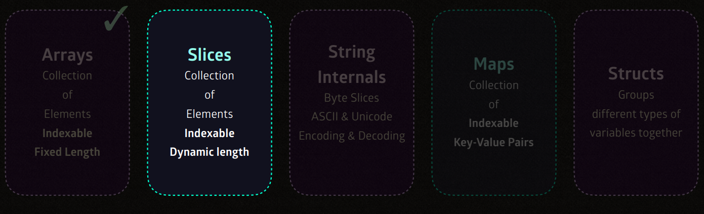
Bài trước chúng ta đã tìm hiểu về Array. Thế thì trước khi bắt đầu chúng ta sẽ nói về điểm khác biệt giữa ```Slices``` Và ```Array```.

- Array trong Go có kích thước cố định và không thể thay đổi sau khi được khởi tạo.```(Array cannot grow or shrink)```.

    - Không thể **Add** hoặc **Remove** phần tử **to/from** array trong lúc runtime.

- Array's Zero value : Sẽ tự động sets **Zero Value** cho các phần tử trong mảng chưa được khai báo.
```go
    var nums [5]int // [0 0 0 0 0] len(nums) sẽ bằng 5
```
- Slice thì linh hoạt hơn có thể thay đổi kích thước một cách linh động. Slice thực chất là một phần của mảng nhưng điểm mạnh của nó là thay đổi độ dài
```(Slices can grow and shrink in runtime)```.

    - Có thể **Add** hoặc **Remove** phần tử **to/from** Slice trong lúc runtime.

- Slice's Zero value : Không giống như array, Silce zero value là ```nil```.

```go
    var nums []int // num is nil => len(nums) sẽ bằng 0
```
# Thế thì Slice là gì ?

Trong Go, **slice** là một cấu trúc dữ liệu linh hoạt hơn **array**. Nếu như mảng có kích thước cố định thì **slice** có thể mở rộng hoặc thu hẹp kích thước một cách Dynamic khi cần. **Có thể coi Slice như 1 "Cửa sổ" nhìn vào **backing array** chứa dữ liệu thực.**

**Cấu trúc của một slice bao gồm:**
- **Pointer**: Con trỏ trỏ đến vị trí của **backing array**.
- **Length**: Chiều dài hiện tại của slice (số phần tử mà slice đang quản lý).
- **Capacity**: Số phần tử tối đa mà slice có thể chứa (tính từ vị trí bắt đầu trong backing array).

## Nil slice
Nil slice là 1 slice chưa được khởi tạo. Nil slice thường xuất hiện khi bạn khai báo một ```slice``` mà chưa sử dụng hàm khởi tạo nào như make() hoặc chưa gán giá trị cho nó.
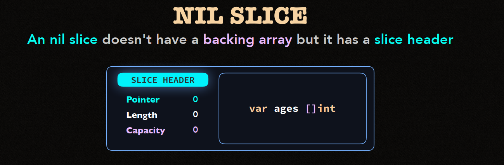
- nil slice không có **Backing array** Nhưng lại có **slice header**. (Chi tiết xem bên dưới)
- nil slice có **chiều dài** (```len```) và **dung lượng** (```cap```) đều = 0

```go
    var s []int // nil slice
    fmt.Println(s)
    fmt.Println(len(s)) // 0
    fmt.Println(cap(s)) // 0
    fmt.Println(s == nil) // true
```

- Không thể get và set phần tử trng Nil Slice.

```go
    var s []int // nil slice

    fmt.Println(s[0]) // Error : paric : runtime error : index out of range

    s[0] = 100 // Error : paric : runtime error : index out of range
```

- Muốn sử dụng Nil slice chúng ta sẽ dùng ```make```.

```go
    s := make([]int,3) // 3 phần tử, giá trị mặc định là 0
    s[0] = 100
    fmt.Println(s) // [100,0,0]
```

```go
    s := []int{10,20,30}
    fmt.Println(s[0])
```
- Muốn sử dụng Nil slice chúng ta sẽ dùng ```append```.

```go
    nums := []int{1,2,3}
    nums = append(nums,4)
    nums = append(nums,9)
    // nums = append(nums,4,9)
```

```go
    nums :=[]int{1,2,3}
    tens :=[]int{12,13}

    nums = append(nums,tens...)
```

## Slice Expression

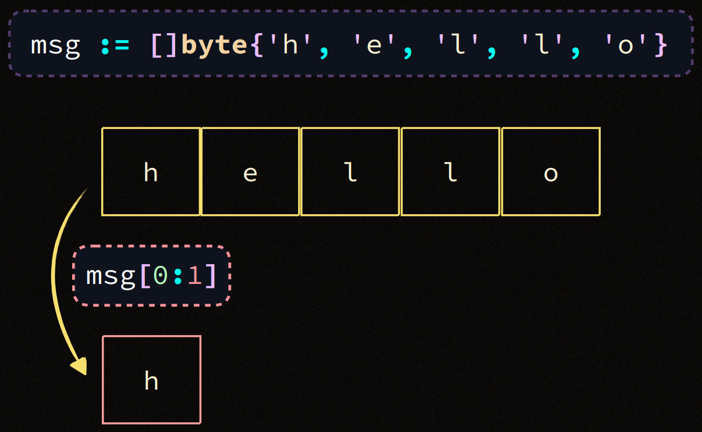
Sliece expression trong Go cho phép trích xuất một phần của slice (hoặc mảng). Sử dụng ```[low:hight]```
- **low** vị trí bắt đầu. Mặc định là 0
- **high** vị trí kết thục . Nếu không chỉ định sẽ mặc dịnh là chiều dài của slice
- Vị trí từ **low** đến **high-1**
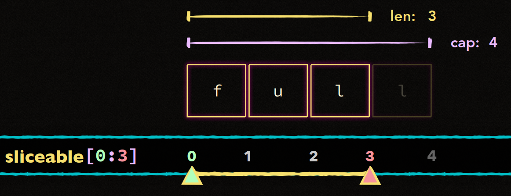
```go
    numbers := []int{10, 20, 30, 40, 50}

    // Lấy các phần tử từ vị trí 1 đến 3 (30 không được tính)
    subSlice := numbers[1:3]
    fmt.Println(subSlice) // Kết quả: [20 30]
```
- ```slice[:3]``` bắt đầu từ 0 -> 3
- ```slice[2:]``` bắt đầu từ 2 -> hết slice

```go
    msg := []byte{'h','e','l','l','o'}
    fmt.Println(append(msg[:4],'!')) // hell!
```

```go
    msg := []byte{'h', 'e', 'l', 'l', 'o'}
    subMsg := msg[:4]            // Lấy slice {'h', 'e', 'l', 'l'}
    newMsg := append(subMsg, '!') // Thêm phần tử '!' vào

    fmt.Println(string(msg))     // Kết quả: "hell!"
    fmt.Println(string(newMsg))  // Kết quả: "hell!"
```
## Backing array
Một slice không lưu dữ liệu riêng của nó mà chỉ trỏ tới 1 mảng nền **(Backing array)**. Điều này có nghĩa là nhiều slice có thể trỏ đến cùng 1 **Backing array**. Khi bạn thay đổi nội dung của một slice, nó cũng có thể ảnh hưởng đến các slice khác chia sẻ cùng **Backing array**.


```go
    ages := []int{35, 15, 25}

    // Trích xuất các slice từ ages
    slice1 := ages[0:1] // Lấy [35]
    slice2 := ages[1:3] // Lấy [15, 25]

    // Thay đổi giá trị của ages thông qua slice1
    ages[0] = 50

    fmt.Println(ages)   // Kết quả: [50 15 25]
    fmt.Println(slice1) // Kết quả: [50] 
    fmt.Println(slice2) // Kết quả: [15, 25] 
```
- ```slice1``` và ```ages``` chia sẻ cùng một **Backing array**. Khi thay đổi giá trị tại ```ages[0]```, slice ```slice1``` cũng thay đổi theo.
- ```slice2``` không ảnh hưởng vì nó trỏ tới phần khác của mảng nền.

**Lưu ý** : Cho dù là empty slice length của nó là zero thì nó vẫn có backing array nhé.
- Slicing và Backing array

```go
    arr := [4]int{1, 2, 3, 4}
    slice := arr[:2]
    slice[0] = 10

    fmt.Println(arr)   // Kết quả: [10 2 3 4]
    fmt.Println(slice) // Kết quả: [10 2]
```

    - ```slice``` thay đổi phần tử đầu tiên nên ```arr``` bị ảnh hưởng và thay đổi theo.

```go
    arr := [4]int{1, 2, 3, 4}
    slice := append(arr[:2], 5, 6)

    fmt.Println(arr)   // Kết quả: [1 2 3 4] (không bị thay đổi)
    fmt.Println(slice) // Kết quả: [1 2 5 6] (tạo ra mảng mới)
```
    - Còn ```append``` thì không làm thay đổi ```backing array```.

## Slice Value.

Slice value trong Go không trực tiếp lưu trữ các phần tử dữ liệu mà **tham chiếu** đến chúng thông qua **backing array**. Cụ thể, slice chỉ lưu trữ một con trỏ trỏ tới **Backing array**. Khi bạn thao tác với slice, bạn thực chất đang thao tác trên **Backing array** thông qua **Memory address** mà slice giữ.

**Cách thức hoạt động của slice value:**

```
    slice {
        Pointer -> (trỏ đến mảng nền)
        Length  -> (chiều dài slice)
        Capacity -> (dung lượng slice)
    }
```

- **Slice value** có ba thanh phần chính đó là **Pointer**,**Length**,**Capacity** (dung lượng).
- **Pointer** trỏ tới 1 phần tử trong **Backing array**.
- **Length** là số phần tử slice quản lý.
- **Capacity** là tổng số phần tử mà slice có thể truy cập trong **Backing array** từ vị trí **Pointer**

```go
    package main

    import "fmt"

    func main() {
        arr := [5]int{1, 2, 3, 4, 5}
        slice := arr[1:4] // Slice trỏ đến phần tử từ vị trí 1 đến 3 của mảng

        fmt.Printf("Slice value: %v\n", slice)
        fmt.Printf("Address of slice's backing array: %p\n", &slice[0]) // Địa chỉ phần tử đầu tiên
        fmt.Println("Length of slice:", len(slice))
        fmt.Println("Capacity of slice:", cap(slice))
    }
```
Kết quả :
```yaml
    Slice value: [2 3 4]
    Address of slice's backing array: 0xc0000180a0
    Length of slice: 3
    Capacity of slice: 4
```
- Sử dụng ```&``` để truy xuất địa chỉ bộ nhớ của các phần tử


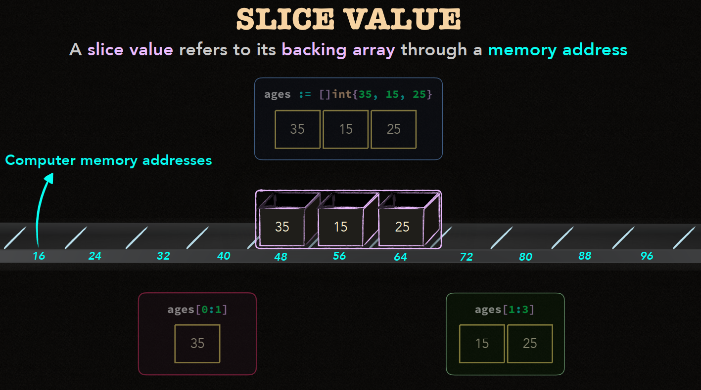

## Slice Header

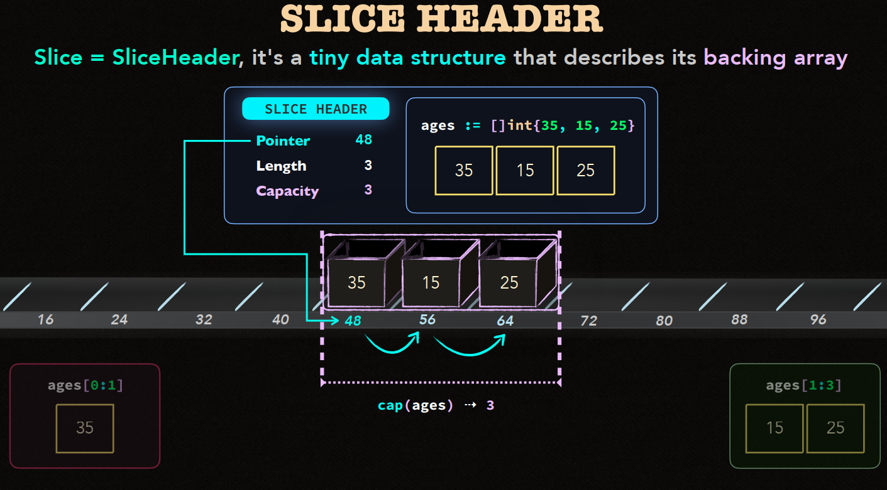

Slice header là cấu trúc nhỏ gọn mô phỏng slice và cách slice quản lý **Backing array**.
Mặc dù bạn không thấy trực tiếp slice header khi code, nhưng nó rất quan trọng trong việc quản lý slice và backing array
Cấu trúc này cũng gồm 3 thành phần như Slice.
- Pointer.
- Length.
- Capacity.

```go
    type SliceHeader struct {
        Data uintptr  // Con trỏ đến mảng nền
        Len  int      // Chiều dài của slice
        Cap  int      // Dung lượng của slice
    }
```

**Một số nguyên tác quan trọng về Slice header**

- **Không thể truy cập vượt quá chiều dài** của slice : Bạn không thể lấy phần tử nằm ngoài số lượng nằm ngoài số lượng phần tử hiện tại của slice.
- **Phần tử trước Pointer slice là "Vô hình"**: Nghĩa là Nếu slice bắt đầu từ vị trí nào đó trong mảng, các phần tử từ trước vị trí đó sẽ không thể thấy được qua slice. Để truy cập được nhưng phần tử nằm trước thì phải **reslice**.

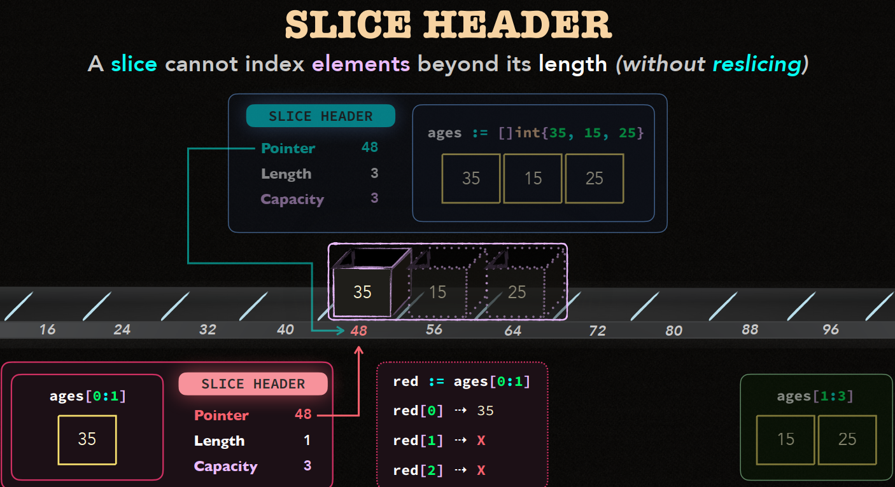

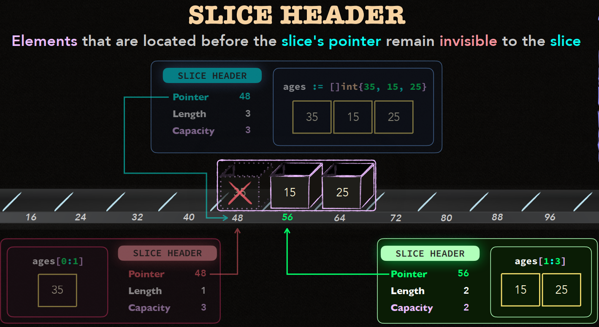

## Cơ chế của ```append()```

Hàm ```append()``` trong Go giúp thêm phần tử vào **slice**. Nhưng để hiểu rõ cách nó hoạt động thì phải hiểu rõ về cách Go quản lý bộ nhớ khi sử dụng ```append()```.

**1. Điều gì xảy ra khi append một phần tử vào slice?**

Khi dùng ```append()``` để thêm một phần tử vào slice, Go sẽ kiểm trang ```Dung lượng``` hiện tại của slice. Nếu dung lượng vẫn còn đủ để chứa phần tử mới, Slice sẽ được mở rộng mà không cần cấp thêm bộ nhớ. Ngược lại nếu dung lượng không đủ, Go phải cấp phát một ```Backing array``` mới lớn hơn để chứa slice mở rộng.

```go
    slice := []int{1, 2, 3}
    slice = append(slice, 4) 
    fmt.Println(slice) // [1 2 3 4]
```

**2. Khi dung lượng đầy, điều gì sẽ xảy ra?**
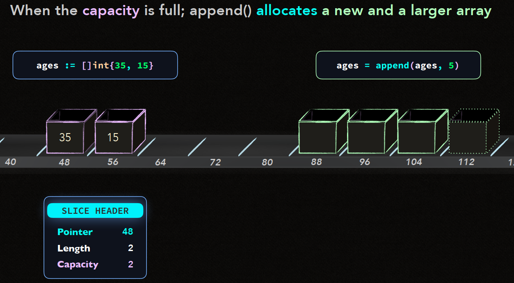
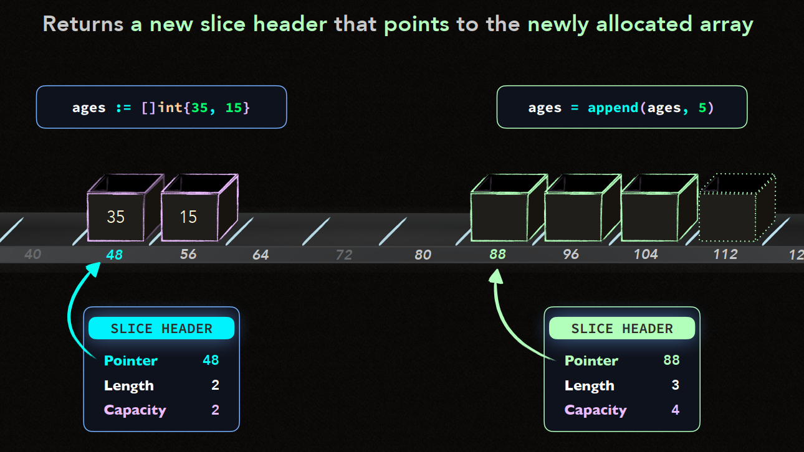
Khi dung lượng của slice đầy (tức là không thể chứa thêm phần tử mới),Go sẽ **cấp phát một mảng mới lớn hơn** để chứa slice mở rộng. Điều này xảy ra trong các bước sau:

- Go **Cấp phát một backing array lớn hơn** để chứa thêm phần tử.
- Go **sao chép** tất cả các phần tử từ mảng cũ vào mảng mới.
- Sau đó, Go **thêm phần tử mới** vào mảng mới.
- Cuối cùng, Go trả về một **slice mới** trỏ đến backing array mới này.

```go
    package main

    import "fmt"

    func main() {
        slice := make([]int, 3, 3) // Slice với chiều dài 3 và dung lượng 3
        slice[0], slice[1], slice[2] = 1, 2, 3

        fmt.Printf("Before append - slice: %v, length: %d, capacity: %d\n", slice, len(slice), cap(slice))

        // Thêm một phần tử khiến Go phải cấp phát mảng mới
        slice = append(slice, 4)

        fmt.Printf("After append - slice: %v, length: %d, capacity: %d\n", slice, len(slice), cap(slice))
    }
```

kết quả :

```go
    Before append   - slice: [1 2 3],   length: 3, capacity: 3
    After append    - slice: [1 2 3 4], length: 4, capacity: 6
```

**3. Tại sao ```append()``` lại cần cấp phát mảng lớn hơn ?**.

Go không chỉ cấp phát một mảng mới có kích thước vừa đủ cho mỗi lần ```append()```.
Thay vào đó, Go cấp phát **một mảng lớn hơn nhiều**. Điều này nhắm mục đích **giảm sớ lần cấp phát bộ nhớ trong tương lai** khi bạn tiếp tục thêm phần tử vào slice. 

Thông thường, dung lượng của slice sẽ được tăng theo cấp số nhân để đảm bảo hiệu quả quản lý bộ nhớ.

- Lợi ích: Việc cấp phát một mảng lớn giúp hạn chế số lần cấp phát mới khi thêm nhiều phần tử, Làm tăng hiệu suất của chương trình.

```go
    slice := []int{1, 2, 3}
    slice = append(slice, 4)  // Dung lượng từ 3 -> 6
    slice = append(slice, 5)  // Dung lượng vẫn còn đủ
    slice = append(slice, 6)  // Dung lượng vẫn còn đủ
    slice = append(slice, 7)  // Dung lượng từ 6 -> 12 (cấp phát mới)
```
**Go sẽ cấp phát mảng lớn hơn theo quy luật: mỗi khi dung lượng cũ đầy, dung lượng mới sẽ được tăng lên đáng kể để giảm số lần cấp phát.**

**4. Slice mới trỏ đến mảng mới**

Sau khi cấp phát mảng mới và sao chép các phần tử từ mảng cũ. Hàm ```append()``` sẽ trả về một slice mới trỏ đến mảng mới. Slice cũ sẽ không bị thay đổi, nhưng slice mới sẽ tham chiếu đến backing array với dung lượng lớn hơn.

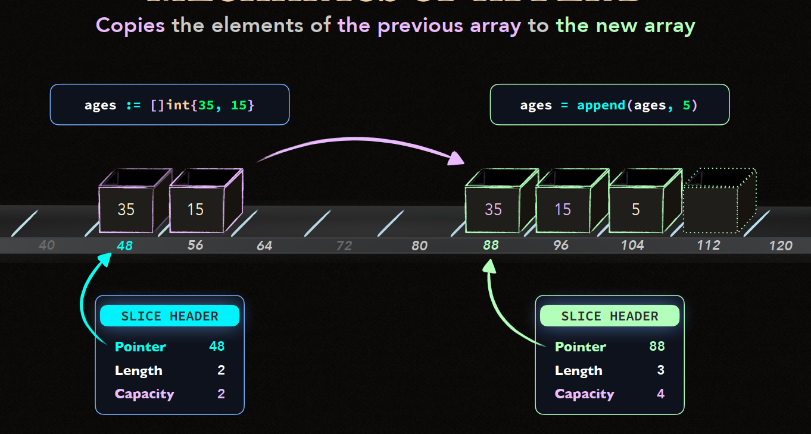

```go
    arr := []int{1, 2, 3}
    newSlice := append(arr, 4)

    fmt.Println(arr)      // Kết quả: [1 2 3]
    fmt.Println(newSlice) // Kết quả: [1 2 3 4]
```
- Khi sử dụng ```append()```, slice mới (```newSlice```) sẽ trỏ đến mảng nền mới, còn mảng ban đầu (```arr```) vẫn giữ nguyên giá trị và không bị thay đổi.

**5. Cơ chép Coppy Elements**

Khi cấp phát mảng mới, Go sẽ sao chép toàn bộ các phần tử từ mảng cũ sang mảng mới. Việc này đảm bảo các phần tử hiện tại của slice không bị mất khi mở rộng dung lượng. Sau khi sao chép, phần tử mới được thêm vào mảng mới.


```go
    slice := []int{1, 2, 3} // Slice ban đầu
    newSlice := append(slice, 4) // Mảng mới được cấp phát với phần tử mới

    fmt.Println(slice)    // [1 2 3]
    fmt.Println(newSlice) // [1 2 3 4]
```

- Sau khi ```append()```, các phần tử của slice cũ vẫn được giữ nguyên trong mảng mới.

**6. Uninitialized Elements (Phần tử chưa khởi tạo)**

Khi một slice được mở rộng và thêm phần tử mới, Go tự động gán giá trị mặc định (zero value) cho các phần tử chưa khởi tạo trong mảng nền. Điều này có nghĩa là nếu dung lượng mới lớn hơn chiều dài hiện tại, các phần tử chưa sử dụng sẽ được gán giá trị mặc định (ví dụ,```0```cho số nguyên).


```go
    slice := make([]int, 3, 5) // Slice có 3 phần tử, nhưng dung lượng là 5
    fmt.Println(slice) // Kết quả: [0 0 0]

    slice = append(slice, 1)
    fmt.Println(slice) // Kết quả: [0 0 0 1]

    fmt.Println(len(slice)) // Chiều dài là 4
    fmt.Println(cap(slice)) // Dung lượng vẫn là 5, chưa cần cấp phát mảng mới
```

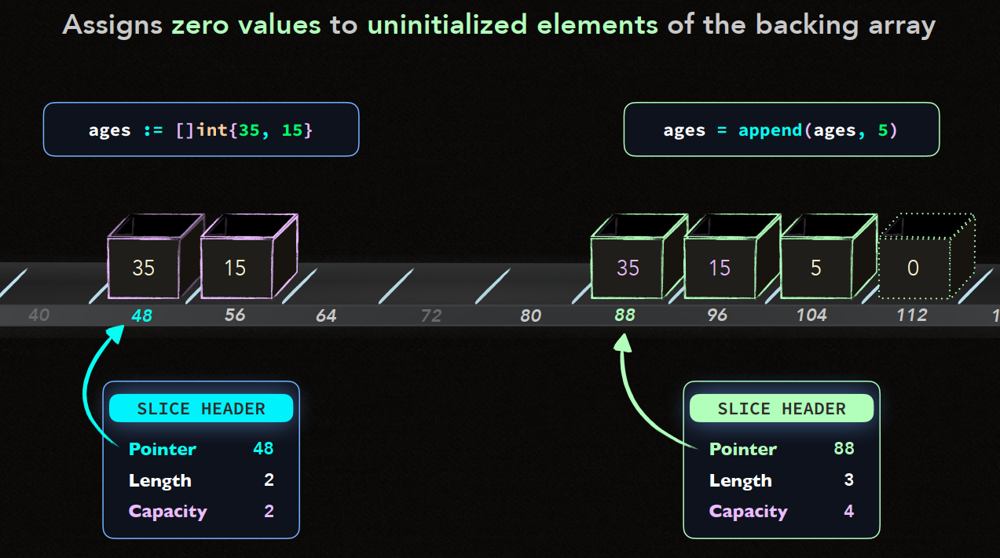


## Full slice expression

Chúng ta đã biết về nhưng thứ cơ bản như ```[START:STOP]```. Thì bên cạnh đó chúng ta có thứ mở rộng hơn ```[START:STOP:CAP]```.

Về ```[START:STOP:CAP]``` không những giới hạn về **length** mà còn cả **capacity**.

```go
    newSlice := oldSlice[START:STOP:CAP]
```

Trong đó:

- **START**: Vị trí bắt đầu của slice.
- **STOP**: Vị trí kết thúc (không bao gồm).
- **CAP**: Dung lượng tối đa mà slice có thể sử dụng từ **backing array**.

Điều quan trọng : **STOP position <= CAP position**

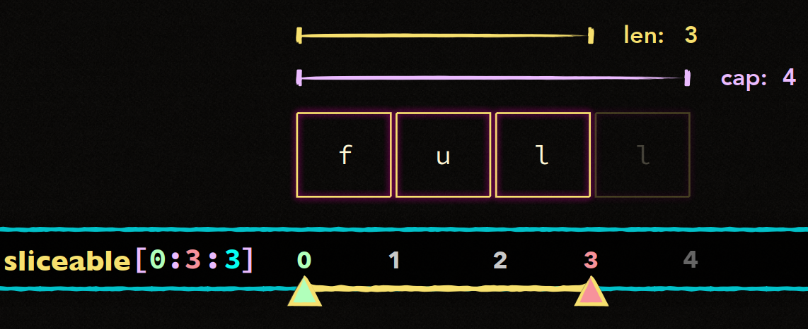
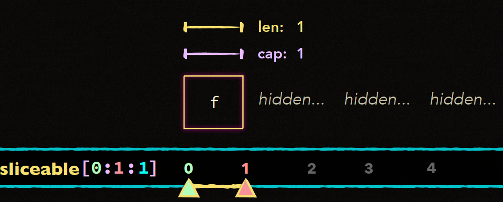
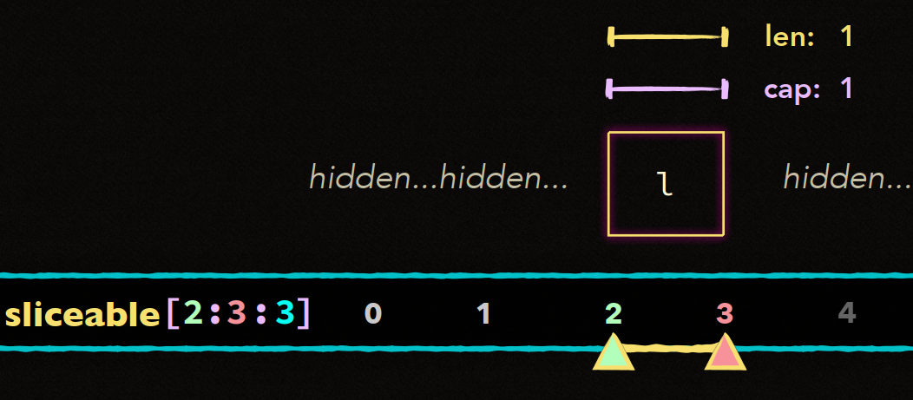
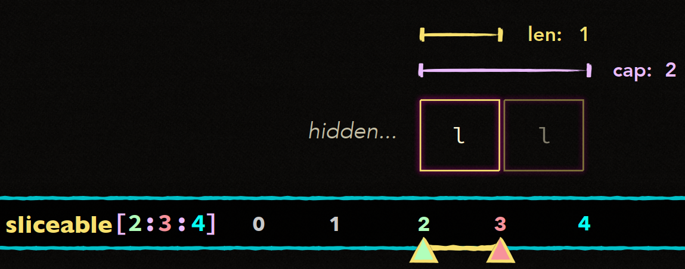
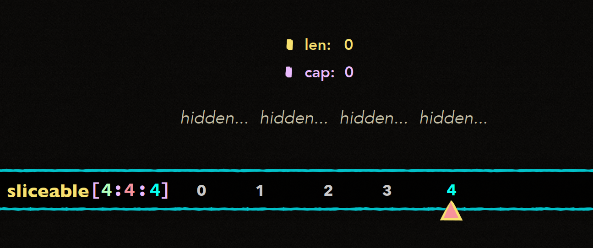

Ví dụ :
```go
    package main

    import "fmt"

    func main() {
        arr := [6]int{10, 20, 30, 40, 50, 60}
        slice := arr[1:4]         // Slice từ vị trí 1 đến 3, dung lượng mặc định là từ 1 đến 5
        fullSlice := arr[1:4:5]   // Slice từ vị trí 1 đến 3, nhưng dung lượng giới hạn từ 1 đến 4

        fmt.Println("Slice:", slice)         // Kết quả: [20 30 40]
        fmt.Println("Length of slice:", len(slice))   // Kết quả: 3
        fmt.Println("Capacity of slice:", cap(slice)) // Kết quả: 5 (dung lượng mặc định từ 1 đến 5)

        fmt.Println("Full Slice:", fullSlice)         // Kết quả: [20 30 40]
        fmt.Println("Length of fullSlice:", len(fullSlice))   // Kết quả: 3
        fmt.Println("Capacity of fullSlice:", cap(fullSlice)) // Kết quả: 4 (giới hạn dung lượng từ 1 đến 4)
    }
```
kết quả :

```yaml
    Slice: [20 30 40]
    Length of slice: 3
    Capacity of slice: 5
    Full Slice: [20 30 40]
    Length of fullSlice: 3
    Capacity of fullSlice: 4
```
- Trong ví dụ này, ```slice``` được cắt với dung lượng mặc định là 5 (từ ```arr[1]``` đến ```arr[5]```), nhưng ```fullSlice``` đã giới hạn dung lượng thành 4 (từ ```arr[1]``` đến ```arr[4]```).


```go
    package main

    func main() {
        arr := [6]int{10, 20, 30, 40, 50, 60}
        
        // Đây sẽ bị lỗi runtime panic vì STOP vượt quá CAP
        slice := arr[1:5:4]
        fmt.Println(slice)
    }
```
kết quả:

```go
    panic: runtime error: slice bounds out of range [:5] with capacity 4
```

```go
    arr := [6]int{10, 20, 30, 40, 50, 60}
    slice := arr[1:4:5]  // Slice có thể truy cập đến vị trí thứ 4 của mảng nền
    fmt.Println(slice)    // Kết quả: [20 30 40]
    fmt.Println(cap(slice)) // Kết quả: 4
```

- **Lưu ý** : Cách **capacity** của slice hoạt động liên quan trực tiếp đến **backing array**. **CAP** trong cú pháp **[START:STOP:CAP]** chỉ định giới hạn của slice và vị trí CAP này tương ứng với **vị trí trong Array**.
Nghĩa là **CAP như một giới hạn trong backing array mà slice có thể truy cập**

- Sử dụng Full Slice Expression để bảo vệ dữ liệu.

```go
    package main

    import "fmt"

    func main() {
        data := [10]int{1, 2, 3, 4, 5, 6, 7, 8, 9, 10}
        
        // Tạo một slice chỉ giới hạn người dùng xem đến phần tử thứ 5
        limitedSlice := data[2:5:5]

        fmt.Println("Limited Slice:", limitedSlice) // Kết quả: [3 4 5]
        fmt.Println("Capacity of limitedSlice:", cap(limitedSlice)) // Dung lượng bị giới hạn chỉ đến phần tử thứ 5

        // Không thể append thêm phần tử ngoài dung lượng đã giới hạn
        // Vì dung lượng bị giới hạn, bất kỳ thao tác nào ngoài giới hạn này sẽ yêu cầu cấp phát mới
        extendedSlice := append(limitedSlice, 6)
        fmt.Println("Extended Slice:", extendedSlice) // Kết quả: [3 4 5 6]
        fmt.Println("Capacity of extendedSlice:", cap(extendedSlice)) // Dung lượng của slice mới sau khi cấp phát lại
    }
```

# Đặc biệt quan trọng.

Hàm ```make()``` là 1 hàm quan trọng để khởi tạo slice. Không giống những cú pháp thông thường. ```make``` cho phép khởi tạo slice với ```length``` và ```capacity```.

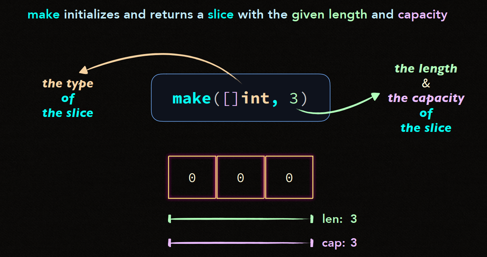

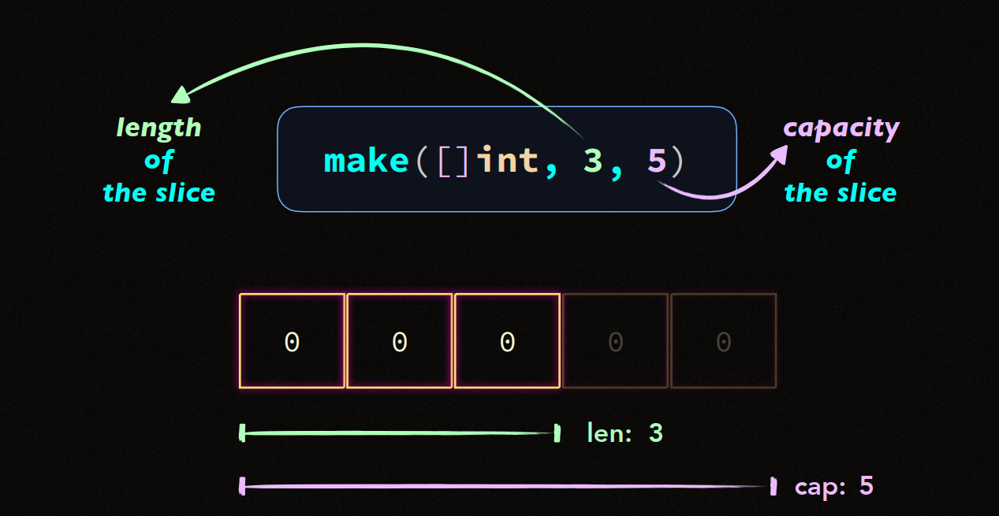

Khi khởi tạo slice với chiều dài bằng 0 = ```make()```, Go sẽ return về 1 slice có dung lượng đã được cấp phát trước nhưng chưa có phần tử nào. Điều này có nghĩa là slice đã sẵn sàng sử dụng ```append()```mà không cần cấp phát bộ nhớ ngay từ đầu.

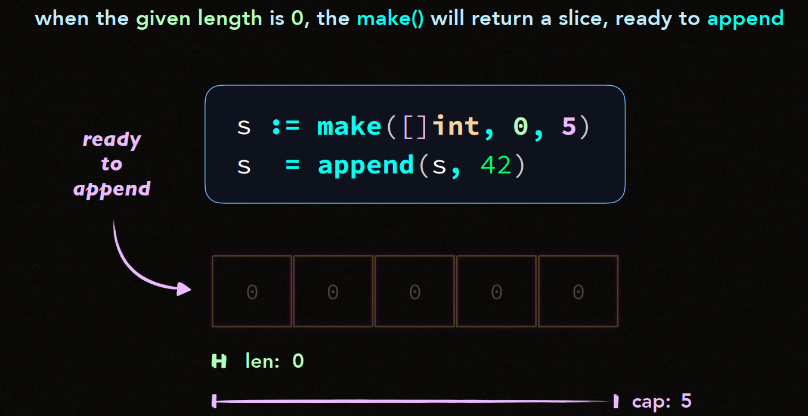

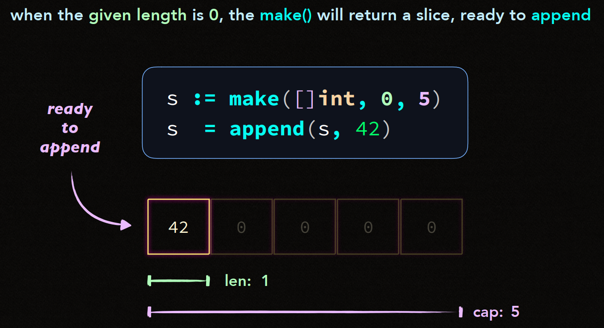

và đặc biệt chú ý đó là ```make()``` hiệu quả hơn cho viẹc tạo ```slice```

- **Kiểm soát được dung lượng slice ngay từ đầu**.
- **Giảm số lần cấp phát bộ nhớ**.
- **Sẵn sàng cho sử dụng hàm ```append()```**.

```go
    slice := make([]int, 0, 5) // Slice có dung lượng ban đầu là 5
    for i := 0; i < 10; i++ {
        slice = append(slice, i)
        fmt.Printf("Slice: %v, Length: %d, Capacity: %d\n", slice, len(slice), cap(slice))
    }
```
Kết quả :
```yaml
    Slice: [0], Length: 1, Capacity: 5
    Slice: [0 1], Length: 2, Capacity: 5
    Slice: [0 1 2], Length: 3, Capacity: 5
    Slice: [0 1 2 3], Length: 4, Capacity: 5
    Slice: [0 1 2 3 4], Length: 5, Capacity: 5
    Slice: [0 1 2 3 4 5], Length: 6, Capacity: 10
    Slice: [0 1 2 3 4 5 6], Length: 7, Capacity: 10
    Slice: [0 1 2 3 4 5 6 7], Length: 8, Capacity: 10
    Slice: [0 1 2 3 4 5 6 7 8], Length: 9, Capacity: 10
    Slice: [0 1 2 3 4 5 6 7 8 9], Length: 10, Capacity: 10
```
... 