Trước đó chúng ta đã tìm hiểu về ```Composite Types- Slice```. 
Series số 5 này sẽ tìm hiểu về ```Composite Types - String```.
.
# Basic Go 5 - Composite Types - String
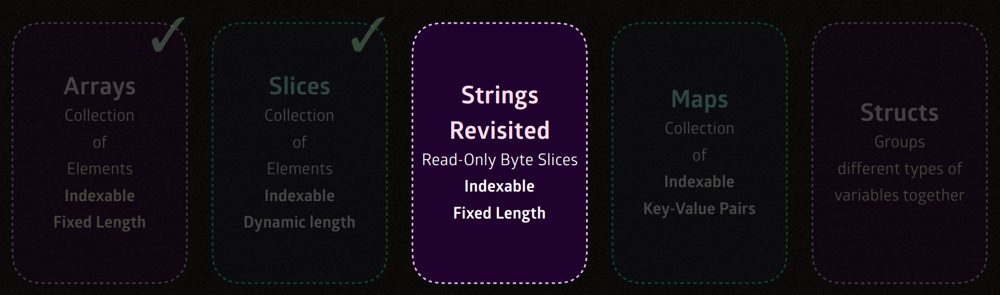

## Bytes,Runes and Strings

1. A string is just a series of bytes

- Trong Golang , ```String``` về cơ bản là một dãy các byte, giúp tối ưu hoá lưu trữ và xử lý dữ liệu dưới dạng nhị phân. Chuỗi là bất biến, tức là sau khi được tao ra, nó không thể thay đổi.

2. String & []byte are interchangeably convertible.

- Bạn có thể chuyển đổi qua lại giữa ```string``` và ```[]byte``` trong Go.

```go
// Chuyển đổi từ string sang []byte
[]byte("hey")

// Chuyển đổi từ []byte sang string
string([]byte{104, 101, 121}) // Kết quả là "hey"

```

3. Rune Literals.

- Rune là một kiểu dữ liệu đại diện cho một ký tự Unicode, được biểu diễn bằng một giá trị gọi là ```Unicode code point``` . 

- Rune có kiểu dữ liệu là ```int32```, nhưng nó được sử dụng để biểu diễn các ký tự, bao gồm cả các ký tự không thuộc bảng mã ASCII.

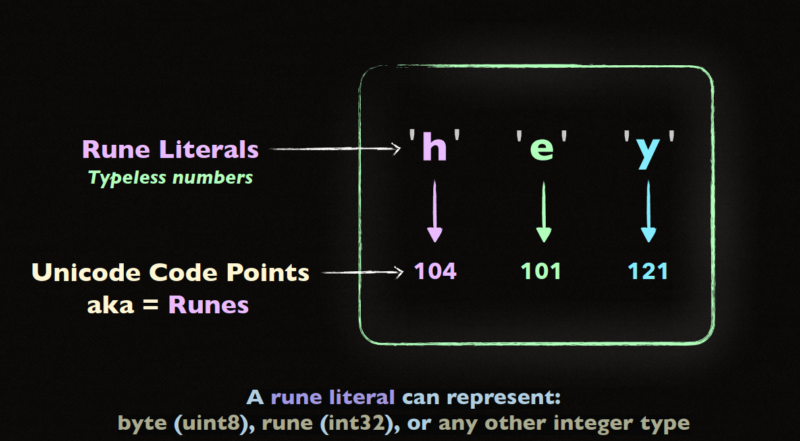

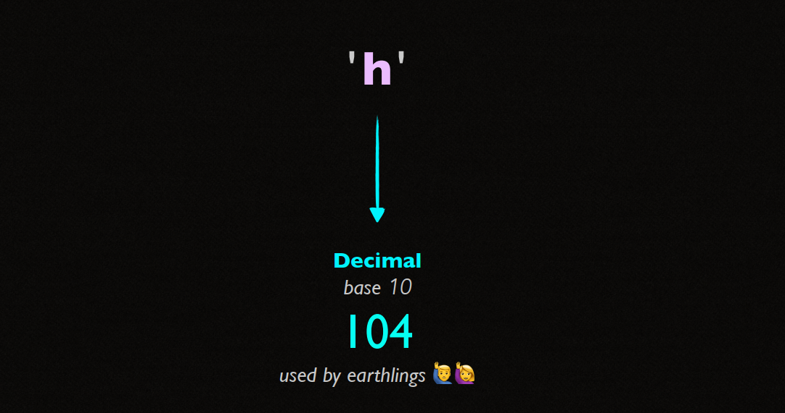

<!--  -->

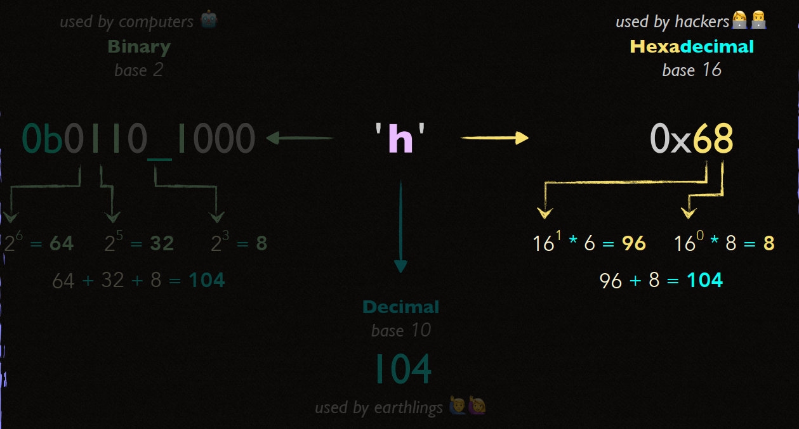

4. Unicode Code Point aka Runes 

- Mỗi rune đại diện cho một điểm unicode code point, bao gồm các ký tự trên toàn thế giới.

5. Converting, Indexing, and Slicing

- Đầu tiên các string sẽ được tự động convert theo UTF-8

```go
s := "Hello , 世界"

```

6. The other string values do not need to be encoded in UTF-8

- Go cho phép bạn làm việc với các chuỗi dưới dạng byte mà không cần phải mã hóa lại chúng thành UTF-8. Điều này giúp xử lý các chuỗi dữ liệu nhị phân (binary) hoặc các định dạng mã hóa khác một cách hiệu quả. 

- Chuỗi trong Go thực sự chỉ là một dãy byte, vì vậy bạn có thể lưu trữ bất kỳ dữ liệu nhị phân nào trong chuỗi mà không bắt buộc phải sử dụng mã hóa UTF-8.

```go
b := []byte{0x48, 0x65, 0x6C, 0x6C, 0x6F}  // Mảng byte không mã hóa UTF-8
s := string(b)  // Chuyển mảng byte thành chuỗi
fmt.Println(s)  // Kết quả: Hello
```

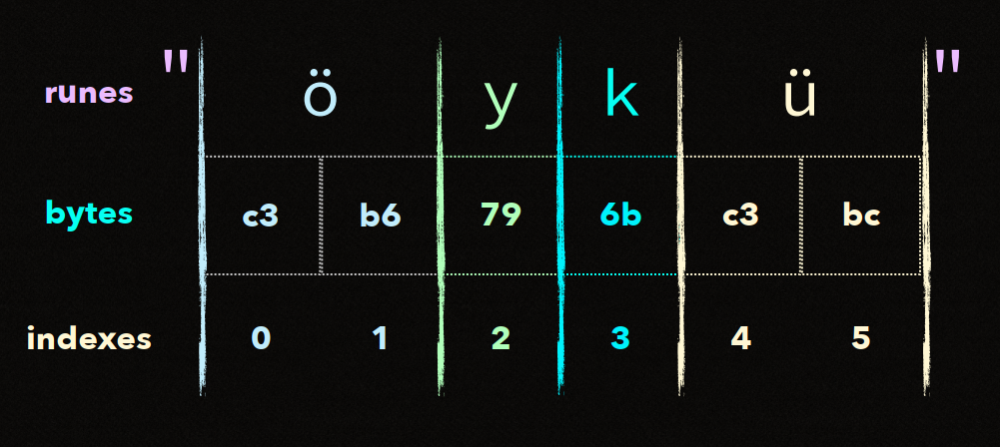

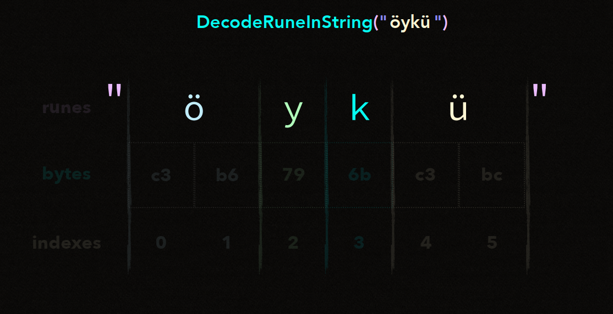

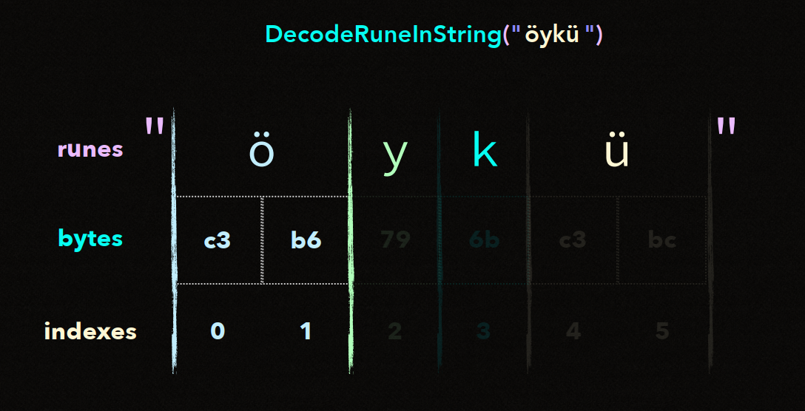

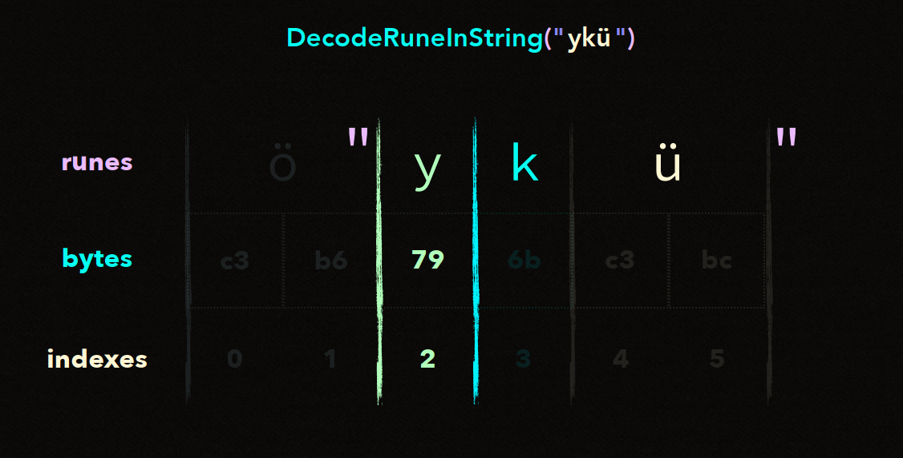

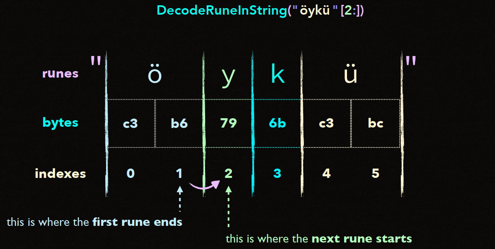

- Trong nhưng ví dụ trên ta sử dụng ```utf8.DecodeRuneInString```, hàm này giúp decode một rune từ chuỗi UTF-8 và trả về rune tương ứng cùng với số byte mà rune đó chiếm giữa trong chuỗi.

- Duyệt chuỗi bằng cách sử dụng **index**

## String internal

1. Why string values are read-only or immutable.

- Chuỗi trong Go là **immutable (bất biến)**, nghĩa là sau khi một chuỗi được tạo ra, nội dung của nó không thể thay đổi. 

- Điều này đảm bảo an toàn khi chuỗi được chia sẻ giữa nhiều phần của chương trình hoặc giữa các **goroutines** khác nhau mà không cần **synchronization**.

2. A string is a data structure that points to a read-only backing array.

- Chuỗi trong Go thực chất là một **struct** gồm hai thành phần:

    1. **Pointer** trỏ tới backing array.

    2. **Length** của chuỗi.

- Khi một chuỗi được tạo ra, nó chỉ tạo con trỏ trỏ tới mảng dữ liệu đó mà không cần sao chép toàn bộ nội dung.

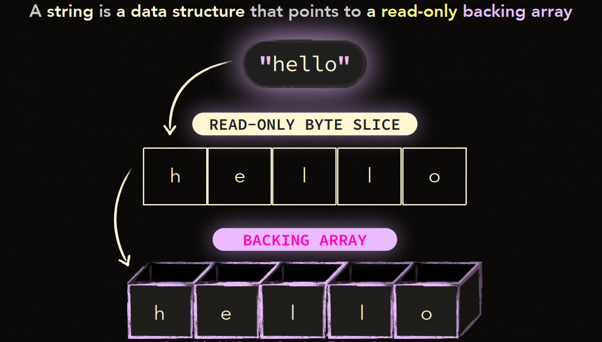

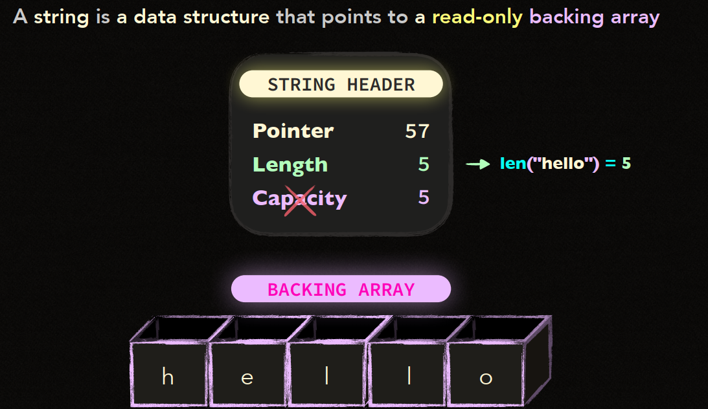

3. String Header stores where a string value starts and ends in memory.

- **String Header** là một cấu trúc dữ liệu trong Go bao gồm con trỏ và độ dài, giúp xác định vị trí bắt đầu và kết thúc của chuỗi trong bộ nhớ.

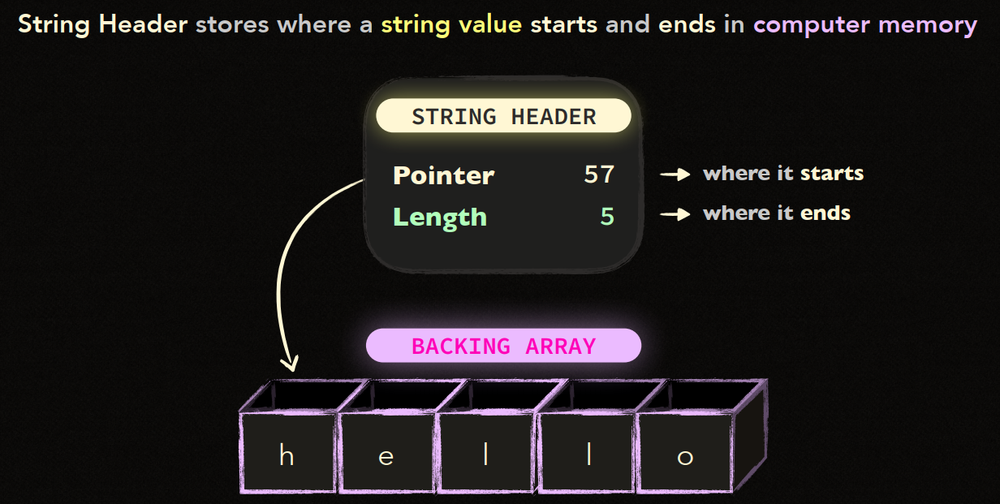

4. The backing array is shared among the same string values

- Khi nhiều chuỗi có cùng nội dung, Go có thể tối ưu bằng cách **share** cùng một **backing array** thay vì tạo các bản sao của mảng. Điều này giúp tiết kiệm **memory** và tối ưu **performance**.

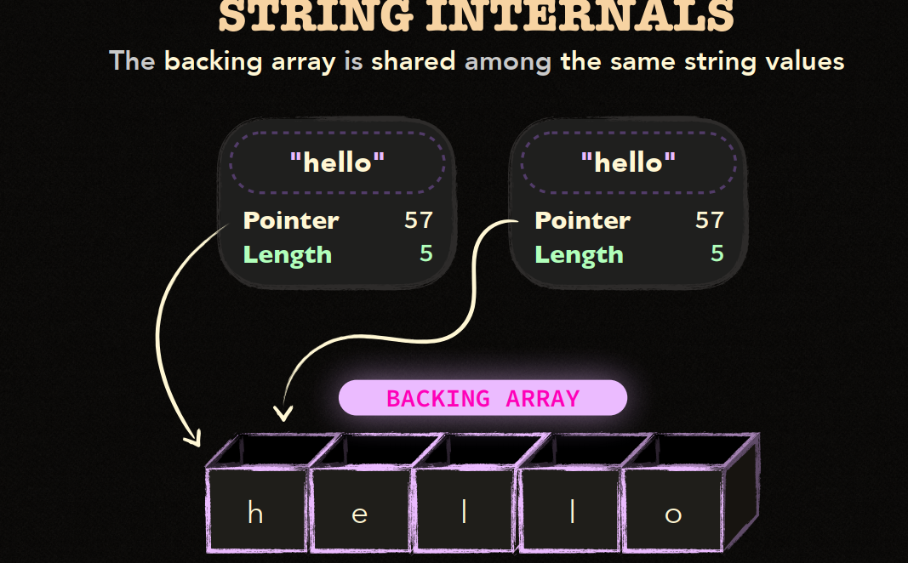

5. The backing array is also shared among the sliced string values

- Khi bạn **slice** một chuỗi, Go tạo ra một chuỗi mới trỏ đến phần của **backing array** cũ mà không cần tạo lại mảng mới. 

- Điều này giúp tiết kiệm tài nguyên, nhưng có thể khiến **garbage collector** giữ lại nhiều dữ liệu hơn mức cần thiết nếu chuỗi gốc rất lớn.

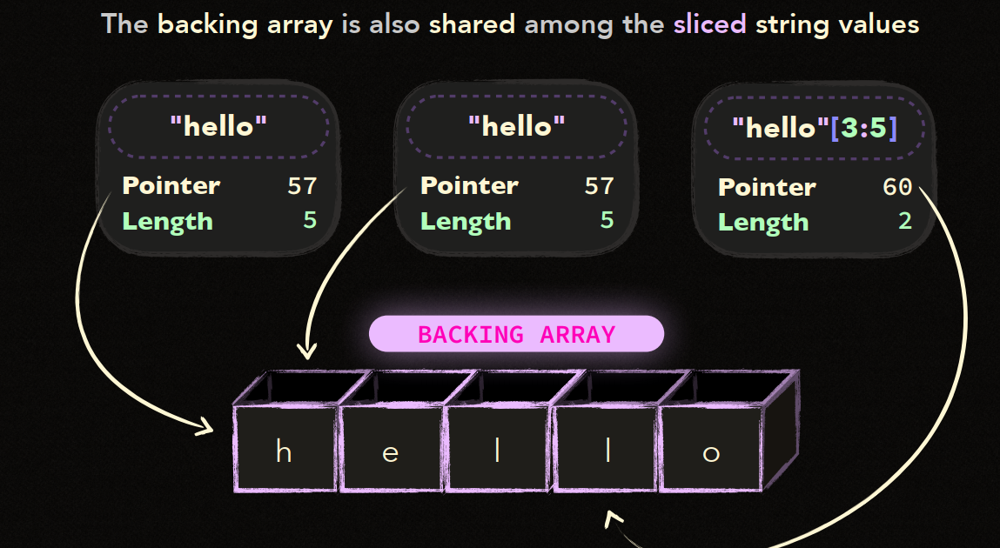

6. Conversion may allocate a new backing array.

- Khi bạn thực hiện **conversion** từ chuỗi sang các kiểu dữ liệu khác (như từ chuỗi thành **[]byte**), Go có thể cấp phát một **new backing array** để chứa dữ liệu mới, vì chuỗi gốc là bất biến.


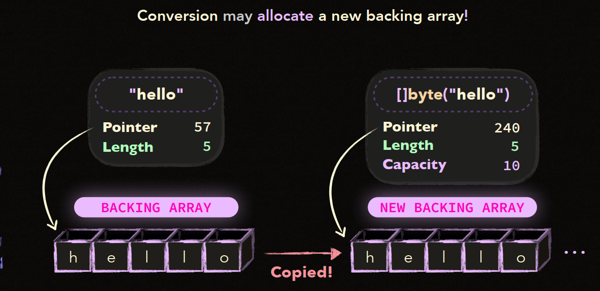