Series số 8 này sẽ tìm hiểu về ```Funtions and Pointer - Funtions```.
.
# Basic Go 8 - Funtions and Pointer - Funtions


Trong go , Một function đều được bắt đầu bằng ```func```.

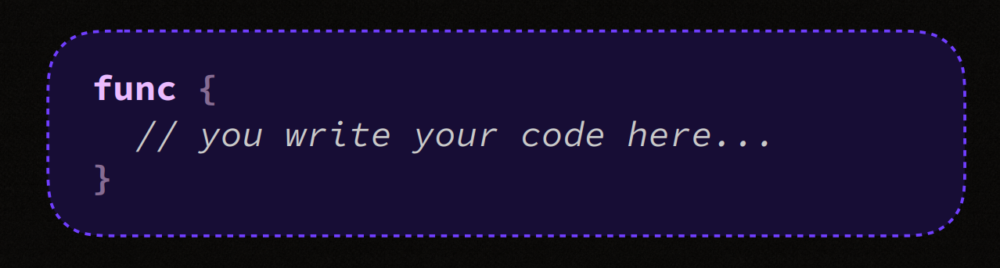

- Tiếp theo sẽ là tham số đầu vào nếu có

- Mỗi function đều được khai báo ở cấp độ package và có một tên duy nhất trong phạm vi package đó.

- Các tên như ```int``` và ```main``` là đặc biệt , Không nên dùng các tên này cho các function khác. vì chúng có vai trò đặc biệt trong Go.

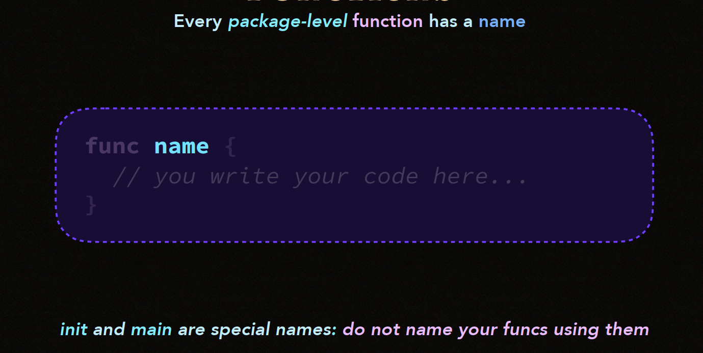

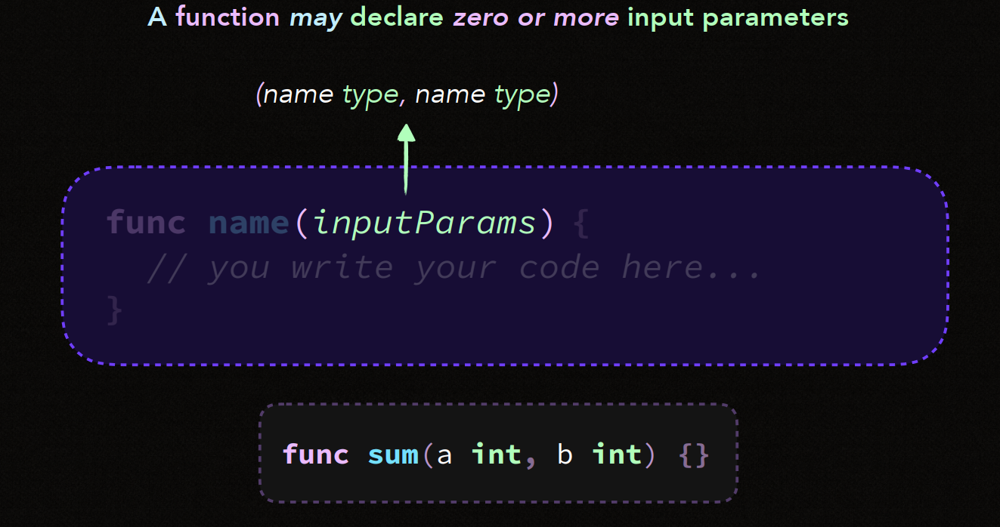

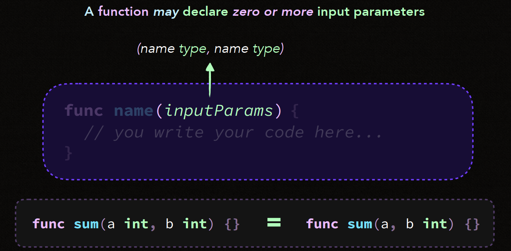

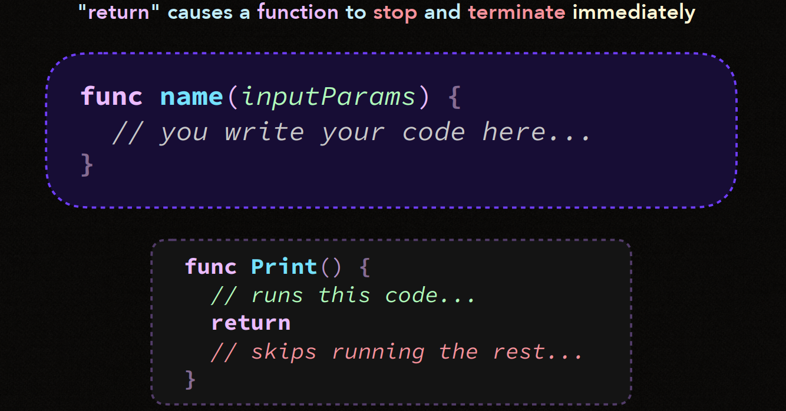

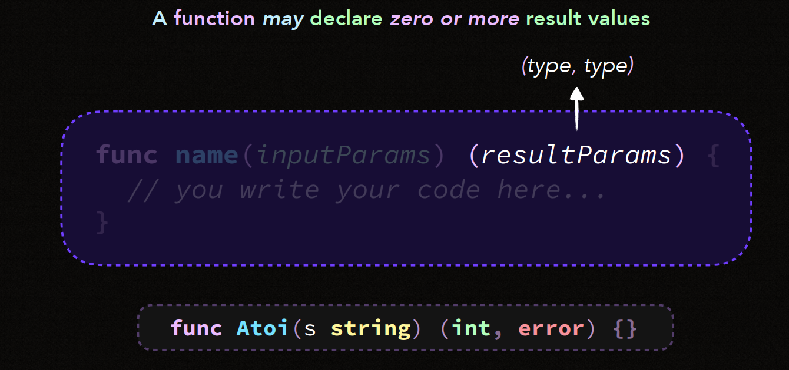

- Function có thể khai báo **không hoặc có nhiều tham số đầu vào**.

- Khi muốn dừng function chúng ta sử dụng ```return``` để lấy giá trị trả về/

- Đôi khi một function có thể không có hoặc có nhiều giá trị trả về .

```go
    func SayHello() {
        fmt.Println("Hello, world!")
    }

    func Add(a int, b int) int {
        return a + b
    }

```

- **Quy tắc** : Nếu một function trả về giá trị (error) , nó **luôn được khai báo là giá trị cuối cùng** trong danh sách trả về.

```go
    func Divide(a, b float64) (float64, error) {
        if b == 0 {
            return 0, fmt.Errorf("cannot divide by zero")
        }
        return a / b, nil
    }
```

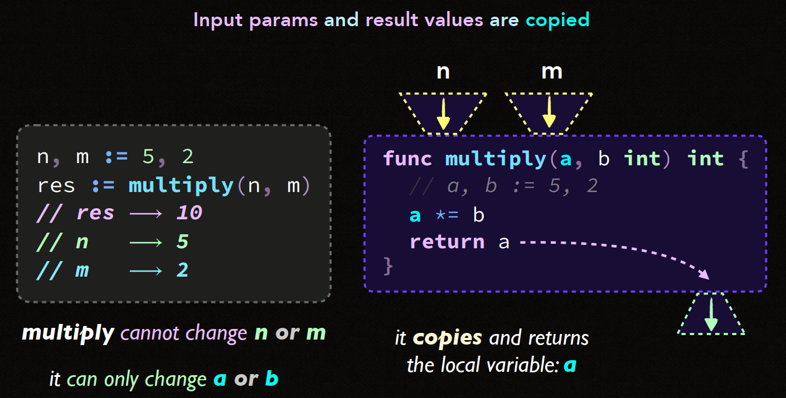

- Vấn đề cuối cùng đó là Package level variable . Sẽ rất khó khăn trong việc debug nhiều package của bạn có quá nhiều function trỏ tới 1 variable.

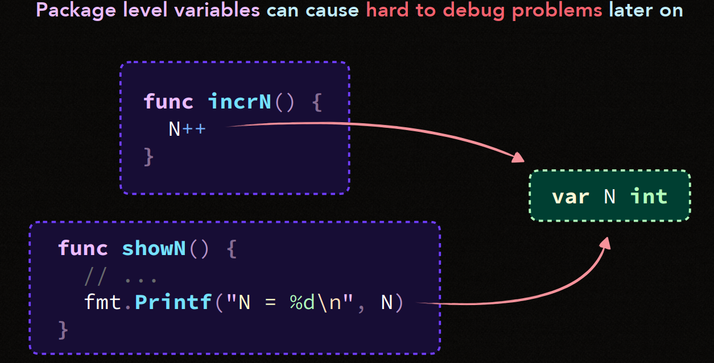
## PROGRAM DESIGN
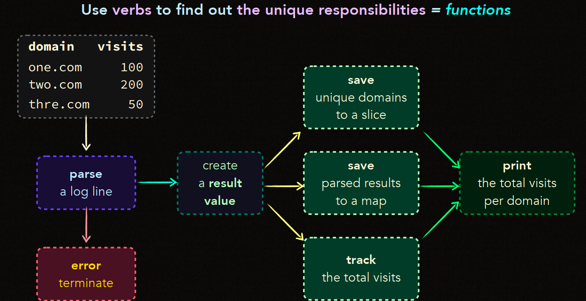

- Nhìn vào sơ đồ , chúng ta có thể thấy **Mỗi hàm chỉ nên làm một việc** Đây là quy tắc quan trọng , quy tác này giúp code của mình dễ hiểu và dễ bảo trì hơn.

```go
    func parseLogLine(line string) (string, int, error) {
        // Phân tích chuỗi log và trả về domain, visits, và lỗi nếu có
    }

    func createResult(domain string, visits int) Result {
        // Tạo ra một đối tượng Result chứa domain và visits
    }

    func saveUniqueDomain(domains []string, domain string) []string {
        // Kiểm tra xem domain có tồn tại chưa, nếu chưa thì thêm vào slice
    }

    func saveParsedResult(resultMap map[string]int, domain string, visits int) {
        // Cập nhật kết quả phân tích vào map với domain là key, visits là value
    }

    func trackTotalVisits(total *int, visits int) {
        // Cộng dồn số lượng truy cập vào tổng
    }

    func printResults(resultMap map[string]int) {
        // In ra kết quả: mỗi domain và số lượt truy cập tương ứng
    }

    func handleError(err error) {
        if err != nil {
            log.Fatal(err)  
        }
    }
```

## NAKED RETURN

- **Naked Return** là một tính năng trong Go cho phép bạn trả về các **giá trị kết quả đã được đặt tên** mà không cần phải ghi rõ chúng trong ```return```.

- Khi sử dụng **Naked Return** các giá trị sẽ được tự động trả về dựa trên các biến đã khai báo trong phần khai báo hàm.

- Tuy nhiên cần lưu ý rằng việc sử dụng **Naked Return** có thể làm cho phức tạp hoá vấn đề.

```go
    func example() (result1 int, result2 string) {
        result1 = 42
        result2 = "Hello, Go"
        return // đây là naked return
    }
```

```go
    func divide(a, b int) (result int, err error) {
        if b == 0 {
            err = fmt.Errorf("division by zero")
            return
        }
        result = a / b
        return
    }
```

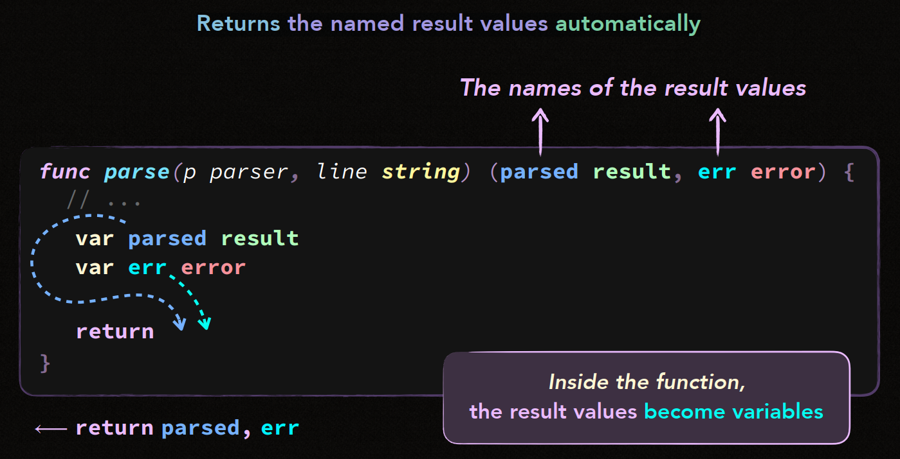

**Ưu điểm :**

- Ngắn gọn và Tự động trả về kết quả.

**Nhược điểm :**

- Khi function quá dài thì làm cho code phức tạp. Và code sẽ trở nên khó đọc.

- Người đọc sẽ không hiểu hiện tại đang return về thứ gì.

Vậy khi nào nên sử dụng **Naked return**

- Nên sử dụng trong các function đơn giản và có độ dài không nhiều.

- Trong các hàm phức tạp hơn hoặc có nhiều logic điều kiện, việc dùng naked return có thể gây nhầm lẫn, do đó nên tránh.

Example 1 : Nên dùng
```go
    func calculateSomething(input int) (result int, err error) {
        if input < 0 {
            err = fmt.Errorf("invalid input")
            return
        }
        result = input * 2
        if result > 100 {
            err = fmt.Errorf("result too large")
            return
        }
        return
    }
```
Example 2 : Không nên dùng vì quá khó đọc.
```go
func processData(input int) (result int, status string, err error) {
    if input < 0 {
        err = fmt.Errorf("negative input is invalid")
        status = "failed"
        return
    }
    
    result = input * 2
    
    if result > 50 {
        status = "large"
        if result%2 == 0 {
            result += 10
        }
        return
    }

    if result > 20 {
        status = "medium"
        return
    }

    if result > 10 {
        status = "small"
        return
    }

    err = fmt.Errorf("result too small")
    status = "error"
    return
}
```

##
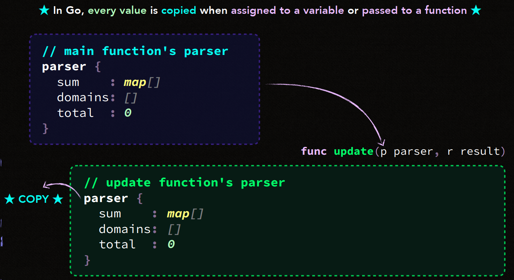

- **Giá trị (value)** trong Go thường được sao chép khi **gán** hoặc **truyền** cho **function**.

- Trừ khi bạn sử dụng Pointer.

- Tuy nhiên vẫn có các ngoại lệ như **map,slice,channels** là các tham chiếu vì vậy chúng sẽ không sao chép nội dung khi truyền vào.

- Như trong ảnh khi bạn gọi hàm **update function** ```update(p parser, r result)```, giá trị ```parser``` được coppy và gán cho ```p```.

- Bất kỳ thay đổi nào trong ```p``` sẽ không làm ảnh hưởng tới ```parser``` ban đầu.


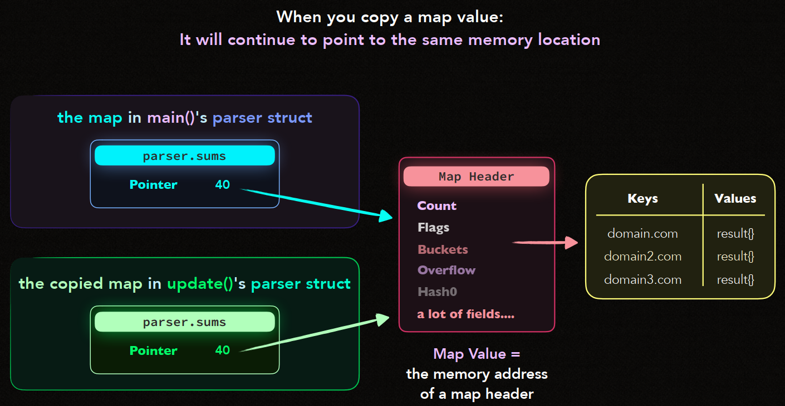

- Đầu tiên khi map được sao chép , chỉ có địa chỉ bộ nhớ của map header được sao chép đi.

- Điều này có nghĩa là tất cả bản sao của map đó vẫn trỏ đến cùng 1 tập dữ liệu.

- Bất kỳ thay đổi nào cũng ảnh hưởng đến cả 2 .

- Kể cả khi đã sao chép map ra một struct khác cũng sẽ ảnh hưởng trực tiếp tới map gốc.

**Chú ý: Khi làm việc với các kiểu dữ liệu tham chiếu như map, cần cân nhắc kỹ lưỡng về cách chúng được truyền hoặc sao chép để tránh gây ra lỗi không mong muốn.**

##

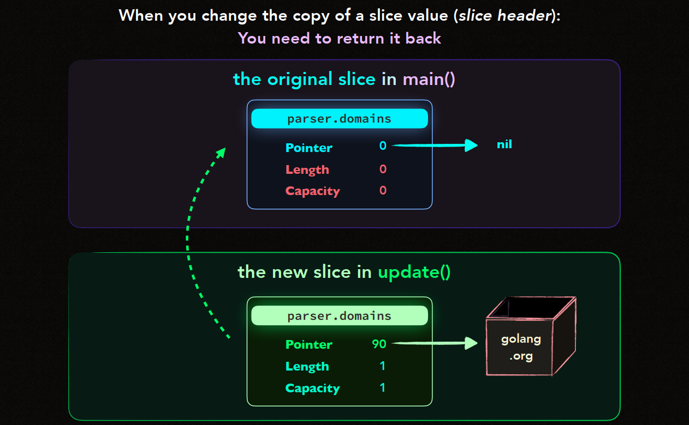

- Khi sao chép Slice , bạn chỉ sao chép slice header của nó.

- Do đó mọi thay đổi từ Slice coppy sẽ không ảnh hưởng đến slice gốc.