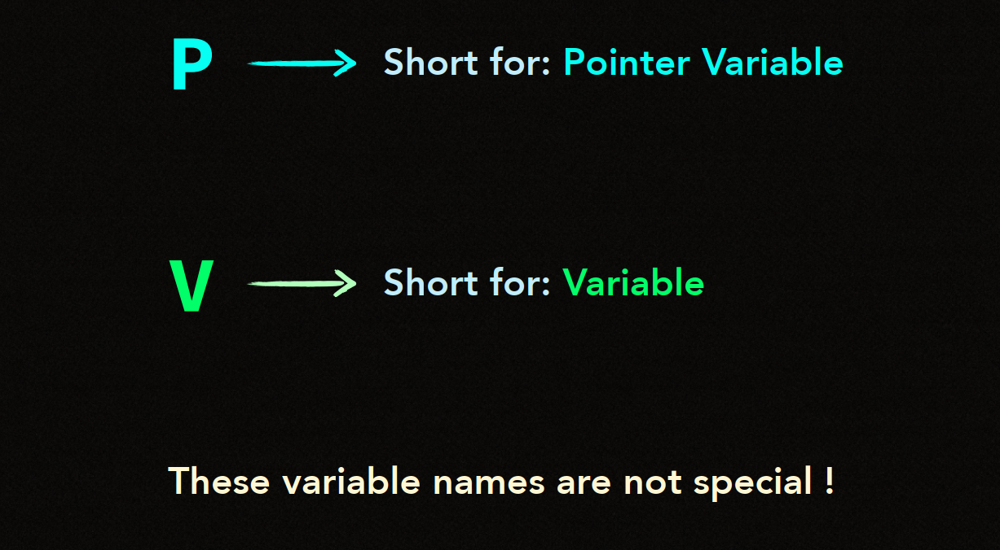
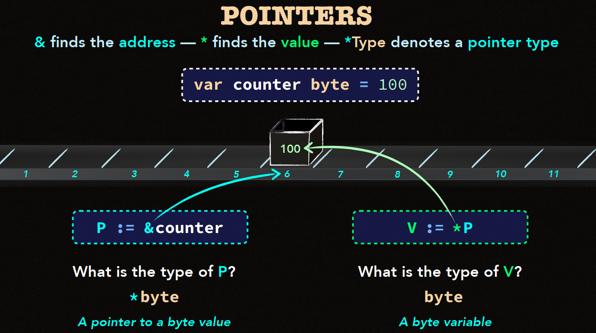
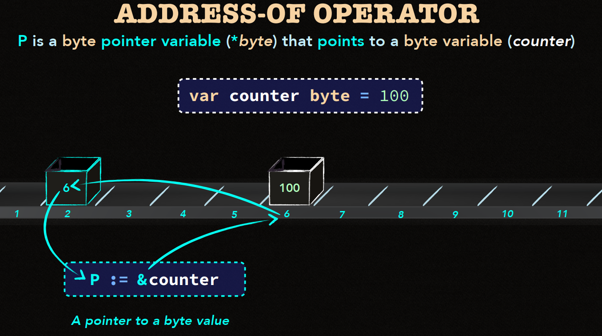
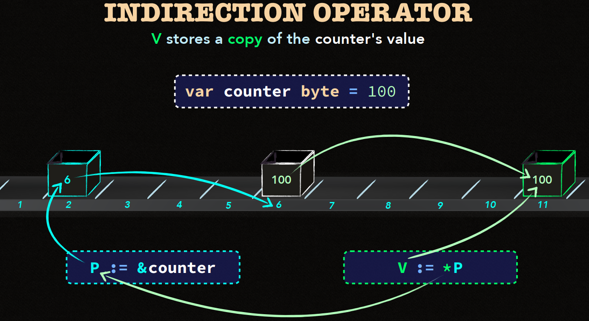
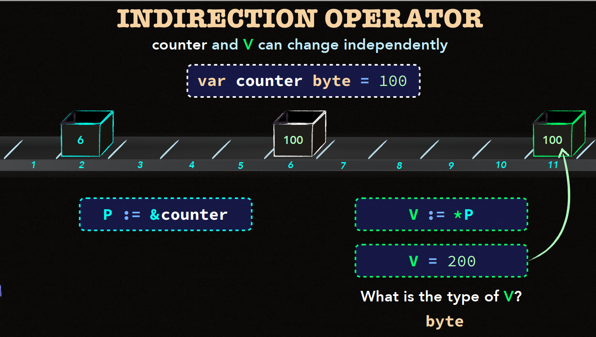
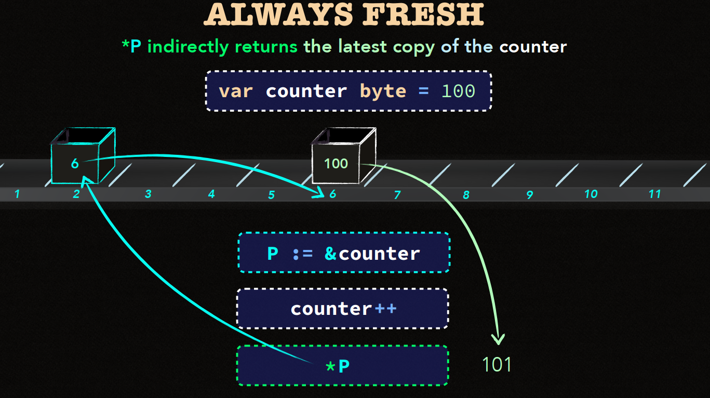
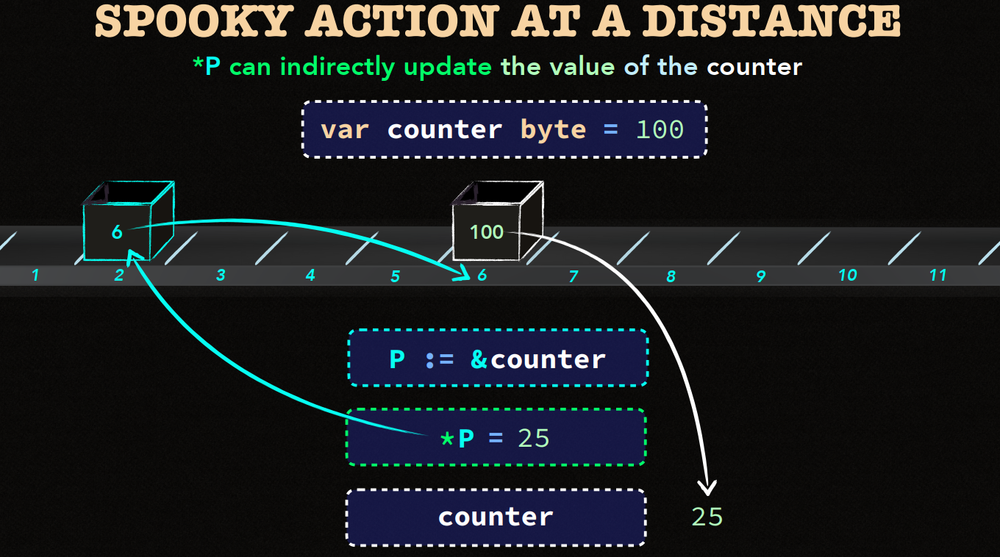
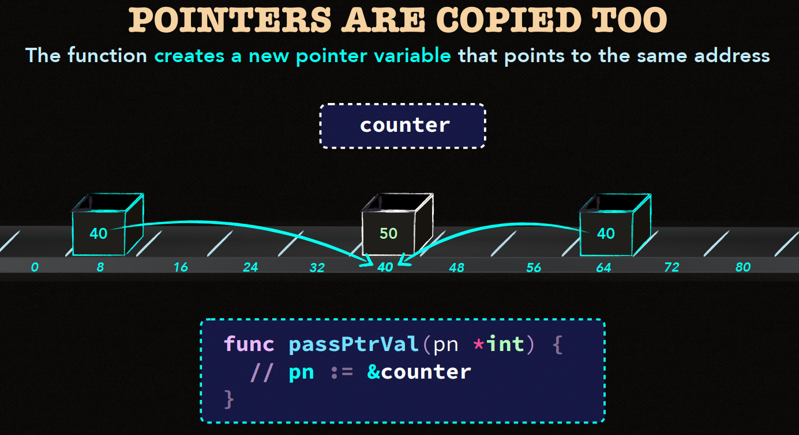
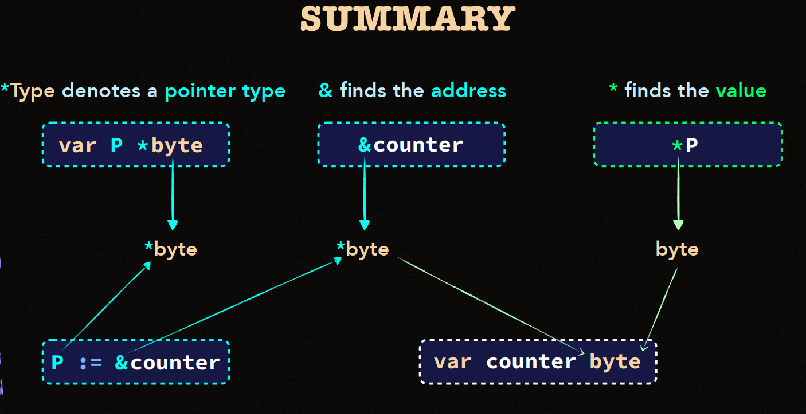
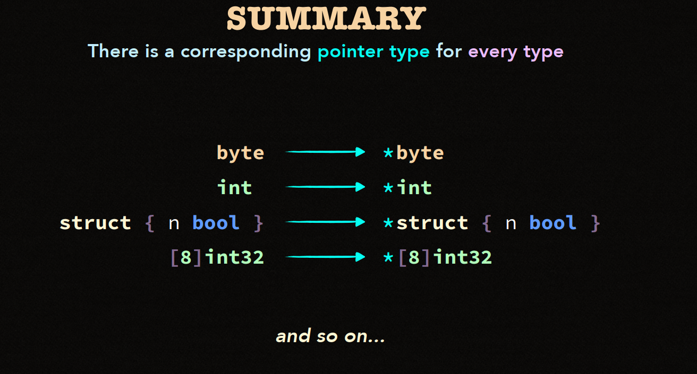

Series số 9 này sẽ tìm hiểu về ```Funtions and Pointer - Pointer```.
.
# Basic Go 9 - Funtions and Pointer - Pointer


Trong go, **Pointer** là một kiểu dữ liệu lưu trữ **địa chỉ bộ nhớ** của một biến thay vì lưu trữ giá trị của **biến nào đó cụ thể**.

Sử dụng pointer cho phép bạn làm việc trực tiếp với bộ nhớ, giúp tôi ưu hiệu suất trong một số trường hợp, đặc biệt là khi làm việc với các giá trị lớn hoặc cần thay đổi giá trị của một biến từ bên ngoài hàm.

1. **Các khái niệm cần lưu ý**

- **Pointer** : Là biến lưu địa chỉ bộ nhớ của một biến khác.

- **Memory Address** : Là vị trí cụ thể trong bộ nhớ. Nơi giá trị của biến được lưu.

```yml
Fun fact : Hãy tưởng tượng Memory Address giống như mã hương vị của một cốc cà phê yêu thích của bạn, Ví dụ như 0xCOFFEE ☕ . Pointer giữ địa chỉ đó.
```
- ```&``` (**Address-of Operator**) : Lấy địa chỉ của một biến.

- ```*``` (**Dereference operator**) : Lấy giá trị được lưu tại địa chỉ của con trỏ.

- ```*Type``` : Định nghĩa một **Kiểu con trỏ**. Ví dụ ```*int``` là con trỏ nó trỏ đến biến kiểu ```int```.

```go
var counter byte = 100 // Khai báo biến `counter` kiểu byte

P := &counter // `P` là con trỏ trỏ tới biến `counter`. Kiểu của P là *byte
V := *P       // `V` là giá trị mà con trỏ P trỏ tới. Kiểu của V là byte

```



**- Như bên trên đã đề cập thì chúng ta cần nhớ rằng :**

- Pointer được khai báo bằng cách thêm dấu ```*``` trước kiểu dữ liệu của biến.

- Dấu ```&``` được sử dụng để lấy địa chỉ của biến, và dấu ```*``` để truy cập giá trị tại địa chỉ mà pointer trỏ tới.


Ex:

```go
    package main

    import "fmt"

    func main(){
        x := 10

        p := &x

        fmt.Println("Address of x : ",p)

        fmt.Println("Value of x from pointer p:", *p)

        *p = 20
        fmt.Println("New value :",x)
    }

```

```yml
0xc0000120a8
10
20
```

Ex:

```go
    package main

    import "fmt"

    func updateValue(num *int){
        *num = 100
    }

    func main(){
        x := 10

        updateValue(&x)

        fmt.Println("X = ":x)
    }
```
```yml
100
```
- Qua 2 ví dụ trên bạn có thể thấy rằng : Khởi tạo thì dùng ```*```,  lấy địa chỉ bộ nhớ thì dùng ```&```.

- Riêng với ví dụ 2 thì chúng ta đang update lại value vào bộ nhớ chứ không phải là biến cụ thể. Lấy địa chỉ bộ nhớ từ ```&x``` (ví dụ : **0x123**) thì ```num *int``` sẽ đọc ra **Value** từ địa chỉ **0x123** đang là **10**. Sau đó sẽ tiến hành gán ```*num =100``` vào địa chỉ **0x123**.




2. **ADDRESS-OF OPERATOR (```&```)**.

- Khi sử dụng toán tử ```&``` trước một biến, bạn sẽ lấy được **địa chỉ bộ nhớ** của biến đó.

```go
    var counter byte = 100 // `counter` chứa giá trị 100
    P := &counter           // `P` lưu địa chỉ của `counter`
```

- Ở đây, ```P``` là con trỏ kiểu ```*byte```, trỏ tới địa chỉ bộ nhớ nơi biến ```counter``` được lưu.



3. **INDIRECTION OPERATOR (```*```)**

- Toán tử **Dereference** (```*```) cho phép bạn truy cập hoặc thay đổi giá trị mà một con trỏ nó trỏ tới.

- Nó **gián tiếp** làm việc với giá trị tại một địa chỉ cụ thể.

```go
    V := *P // `V` lưu bản sao của giá trị được lưu tại địa chỉ `P`
```

- ```**V**``` nhận **giá trị** của ```counter``` (ví dụ là ```100```) thông qua con trỏ ```P```.

- Thay đổi ```**V**``` sẽ không ảnh hưởng tới counter vì ```V``` là một bản sao của giá trí.

**Lứu ý : Khi giá trị được sao chép vào ```V```, ```counter``` và ```V``` có thể được thay đổi độc lập với nhau**.



4. **ALWAYS FRESH : LUÔN LẤY GIÁ TRỊ MƠI NHẤT**



- Khị bạn dereference một con trỏ bằng ```*p```, bạn luôn nhận được giá trị mới nhất của biến được con trỏ trỏ tới.

- Nếu giá trị của ```counter``` thay đổi, việc dereference ```P``` sẽ trả về giá trị đã cập nhập.

```go
    var counter byte = 100

    P : = &counter

    counter++
    fmt.Println("*P = "*P)
```

- **Pointer Dereferencing (```P```): Luôn truy cập giá trị hiển tại của biến mà nó trỏ tới, không phải giá trị cũ hay giá trị được cache.


5. **SPOOKY ACTION AT A DISTANCE** : Tương tác giao tiếp từ xa.



- Khi sử dụng pointer, bạn có thể thay đổi giá trị của một biến **gián tiếp** thông qua địa chỉ của nó.

- Điều này đôi khi được gọi 1 cách vui nhộn là **Spooky action at a distance** vì việc thay đổi giá trị xảy ra ở một nơi khác trong bộ nhớ mà không phải trực tiếp truy cập biến gốc.


```go
    var counter byte = 100
    P := &counter
    *P = 25
    fmt.Println(counter) // = 25
```

- **Điều gì đang xảy ra?**

    - Bằng cách sử dụng con trỏ ```P```, ta **gián tiếp thay đổi giá trị của ```counter``` mà không cần truy cập trực tiếp vào biến ```counter```.

    - **Spooky action** này giúp bạn cập nhập dữ liệu từ xa thông qua việc tho tác với địa chỉ bộ nhớ của biến.

6. **POINTER ARE COPIED TOO**



- Khi bạn truyền 1 **Pointer** vào một function, function đó sẽ nhận một **bản sao** của con trỏ gốc, và con trỏ mới đề trỏ tới **cùng một địa chỉ bộ nhớ.**

- Điều này có nghĩa là việc thay đổi giá trị thông qua con trỏ trong **function** vẫn sẽ thay đổi giá trị của biến gốc, nhưng con trỏ được sao chép.

```go
    package main

    import "fmt"

    // Function này nhận vào 1 con trỏ và thay đổi giá trị của biến mà nó trỏ tới
    func updateCounter(p *byte) {
        *p = 50 // Thay đổi giá trị tại địa chỉ mà `p` trỏ tới
    }

    func main() {
        var counter byte = 100
        fmt.Println("Trước khi gọi hàm:", counter) // In ra: 100

        P := &counter
        updateCounter(P) // Truyền con trỏ `P` vào hàm

        fmt.Println("Sau khi gọi hàm:", counter)  // In ra: 50
    }
```

- Trong function ```updateCounter```, một **bản sao** của con trỏ ```P``` được tạo, nhưng nó vẫn trỏ tới cùng một địa chỉ bộ nhớ chứa biến ```counter```.

- Khi **function** thay đổi giá trị thông qua con trỏ, giá trị gốc của ```counter``` cũng bị thay đổi, mặc dù con trỏ bản sao và con trỏ gốc là hai biến riêng biệt.

**Điều quan trọng cần nhớ:**

- Mặc dù con trỏ được sao chép khi truyền vào function, cả con trỏ gốc và bản sao đề cùng trỏ tới một địa chỉ.

- Do đó, mọi thay đổi thông qua một trong hai con trỏ sẽ ảnh tưởng tới biến gốc.

## Sumary



